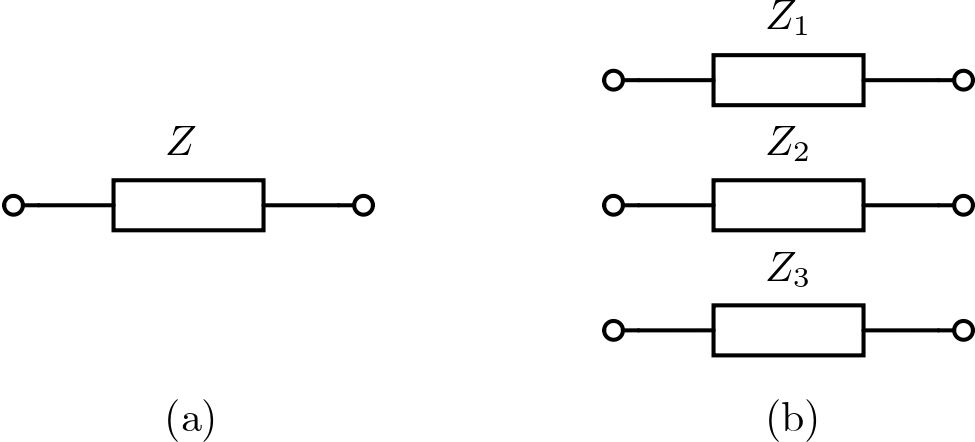

# Impedance Model

Impedance is created as a **series impedance model** as shown in Fig. [1](#fig:impedance_model).  
Impedance values can be given **symbolically** (dependent on angular frequency) or as a **specific value**.



**Figure 1.** Impedance model: (a) single phase or DC; (b) three phase.

---

### Y-Parameter Calculation

For the impedance, **Y parameters** are calculated as:

\[
Y = \begin{bmatrix}
        \operatorname{diag} \left\{\tfrac{1}{Z_{i}} \right\} & -\operatorname{diag} \left\{\tfrac{1}{Z_{i}} \right\} \\
        -\operatorname{diag} \left\{\tfrac{1}{Z_{i}} \right\} & \operatorname{diag} \left\{\tfrac{1}{Z_{i}} \right\}
    \end{bmatrix}, \quad i \in \{1, \ldots, n\},
\]

where **n** is the number of phases.  
> The Y matrix is defined as diagonal, assuming that no mutual couplings exist between the three phases.

---

### Code Explanation

To further provide a detailed overview of the implementation of these impedance models in C++,  
we formulated the above Y parameters using one **`.h`** file and one **`.cpp`** file.  

The derived admittance matrix for single-phase and three-phase impedance models  
provides a clear relationship between currents and voltages in the system.

This report provides a detailed explanation of the code implementation and structure of:

- `impedance.h`
- `impedence.cpp`

> **Note**: The explanation of the code is given only once,  
> but it follows the same structure for all components.

---

## `impedance.h` File

The `impedance.h` file defines the **Impedance** class,  
which is responsible for modelling the impedance and calculating the admittance matrix  
for a given electrical element.

### Full Content of `impedance.h`

```cpp
#ifndef _IMPEDANCE_H_
#define _IMPEDANCE_H_

#include "Element.h"

/*
Creates impedance with specified number of input/output pins which represent phases.
The admittance expression has to be given in Omega and can have both numerical and
symbolic value (example: `z = s-2`). Depending on the provided vector of impedance values,
we differ two cases. Namely, we create only series impedance for each phase with values:
- In the case of 1x1 vector, impedance value is given to all diagonal impedance entries.
- In the case of `pins` elements, they are representing diagonal entries of impedance.
*/

class Impedance : public Element {
public:
    /*
     * Constructor: Impedance
     *
     * Constructs the impedance model with the given symbolic name, number of pins (phases),
     * and a matrix of impedance values. It calculates the admittance matrix based on these values.
     *
     * Parameters:
     * - symbol: Symbolic identifier for the impedance element (e.g., Z1, Z2)
     * - pins: Number of input/output pins (phases)
     * - values: DenseMatrix representing the impedance values
     */
    Impedance(const std::string& symbol, int pins, DenseMatrix values);

    // Destructor to handle any clean-up tasks
    ~Impedance();

private:
    // No additional private members in this class, as the behavior is inherited from Element
};

#endif // _IMPEDANCE_H_
