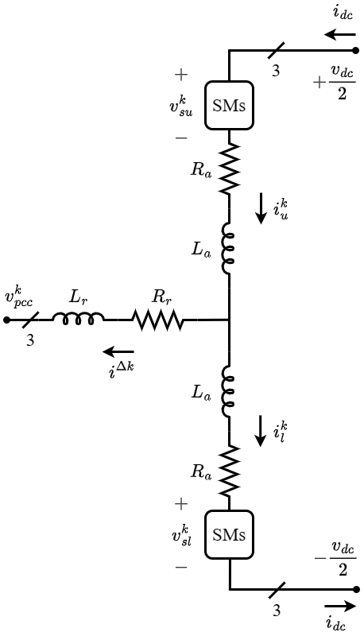
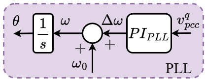

<!--**This model page can be used as template for your own model. If you want to download this page in qmd format, click here:**

<a href="../download/modelTemplate.qmd.txt" download="modelTemplate.qmd">Download model template</a> -->


:::{.callout-tip}
*The Modular Multilevel Converter (`MMC`) is an emerging technology in modern high-voltage direct current (HVDC) systems, renewable energy integration, and motor drives. MMCs provide high efficiency, scalability, and reduced harmonic distortion compared to traditional voltage-source converters (VSCs). Due to their modular structure, MMCs can operate at high power/voltage ratings while maintaining low switching losses and improved output voltage quality.*
:::

<div style="font-size:1.3em; font-weight:600; color:#1c5d9b; border-left:3px solid #1c5d9b; padding-left:10px; margin-top:1.2em; margin-bottom:0.8em;">
Mathmatical Modeling
</div>
---

<div style="font-size:1.1em; font-weight:600; color:#1c5d9b; margin-top:1em; margin-bottom:0.4em;">
🔸 MMC Architecture
</div>

An MMC consists of multiple cascaded submodules (SMs) per phase, typically arranged in an upper and lower arm configuration. Each phase of the converter consists of:

  - Submodules (SMs): Each SM contains capacitors and semiconductor switches, enabling  independent voltage control.
  - Arms: Each phase-leg has an upper and lower arm, controlling the output voltage and current.
  - Arm Inductors: Limiting circulating currents and improving system stability.
  - DC-Link: Connects the converter to the DC grid, providing the required power exchange.

The general structure of a three-phase MMC is shown in @fig-mmc_structure.

{#fig-mmc_structure width=35%}

---

<div style="font-size:1.1em; font-weight:600; color:#1c5d9b; margin-top:1em; margin-bottom:0.4em;">
🔸 Operating Principles
</div>

The MMC operates based on the selective activation of submodules, generating a staircase output voltage waveform. The main operational principles include:

  - Capacitor Voltage Balancing: Ensuring uniform charge distribution across submodules.
  - Circulating Current Suppression: Reducing unwanted AC and DC currents flowing within the converter's arms that do not contribute to power transfer between the AC and DC sides, which improves efficiency.
  - Modulation Techniques: Reducing unwanted AC and DC currents flowing within the converter's arms that do not contribute to power transfer between the AC and DC sides, which improves efficiency.
  
---

<div style="font-size:1.1em; font-weight:600; color:#1c5d9b; margin-top:1em; margin-bottom:0.4em;">
🔸 LTI Model
</div>

The LTI model presented in @sakinci2022generalized has been extended to include measurement filters that are present in the practical converters.

---

<div style="font-size:1.1em; font-weight:600; color:#1c5d9b; margin-top:1em; margin-bottom:0.4em;">
🔸 MMC Dynamics
</div>

The detailed dynamics of the converter model are presented using the procedure developed in @bergna2018generalized,@bergna2018pi, @freytes2017small, @sakinci2022generalized,@lekic2020initialisation. @fig-mmc_structure shows a single-phase architecture for a three-phase MMC, with all variables defined for all the phases, $k\in \{a,b,c\}$. The submodules are represented by an averaged equivalent model, allowing the voltages and currents in the upper and lower arms to be described by (\ref{eq:VI_UL})

\begin{equation} \label{eq:VI_UL}
    v_{su,l}^k = m_{u,l}^k v_{cu,l}^k \hspace{1cm} i_{su,l}^k = m_{u,l}^k i_{u,l}^k
\end{equation}

where $m^k_{u,l}$ are the corresponding upper and lower arm insertion indices.

The $\Sigma-\Delta$ nomenclature can be used to represent the variables in the upper and lower arms @bergna2018generalized as stated in (\ref{eq:i_SD}), (\ref{eq:vc_SD}), (\ref{eq:m_SD}), (\ref{eq:vs_SD}).

\begin{equation}\label{eq:i_SD}
i^{\Delta k} = i_u^k - i_l^k, \qquad
i^{\Sigma k} = \frac{i_u^k + i_l^k}{2}.
\end{equation}

\begin{equation}\label{eq:vc_SD}
v^{\Delta k}_c = \frac{v^k_{cu} - v^k_{cl}}{2}, \qquad
v^{\Sigma k}_c = \frac{v^k_{cu} + v^k_{cl}}{2}.
\end{equation}

\begin{equation}\label{eq:m_SD}
m^{\Delta k} = m^k_u - m^k_l, \qquad
m^{\Sigma k} = m^k_u + m^k_l.
\end{equation}

\begin{equation}\label{eq:vs_SD}
v^{\Delta k}_s = \frac{-v^k_{su} + v^k_{sl}}{2}
= -\frac{m^{\Delta k} v^{\Sigma k}_c + m^{\Sigma k} v^{\Delta k}_c}{2}, \qquad
v^{\Sigma k}_s = \frac{v^k_{su} + v^k_{sl}}{2}
= \frac{m^{\Sigma k} v^{\Sigma k}_c + m^{\Delta k} v^{\Delta k}_c}{2}.
\end{equation}

The differential equations describing the dynamic behavior of the MMC can be derived by using the variables stated in (\ref{eq:i_SD}), (\ref{eq:vc_SD}), (\ref{eq:m_SD}), (\ref{eq:vs_SD}).

\begin{equation}\label{eq:a}
\dot{\vec{i}}^{\Delta dq}
= \frac{\vec{v}_s^{\Delta dq}
- (\omega L_t \boldsymbol{J}_2 + R_t \boldsymbol{I}_2)\vec{i}^{\Delta dq}
- \vec{v}^{dq}_{pcc}}{L_t}
\end{equation}

\begin{equation}\label{eq:b}
\dot{\vec{i}}^{\Sigma dq}
= -\frac{\vec{v}_s^{\Sigma dq}
+ (R_a \boldsymbol{I}_2 - 2\omega L_a \boldsymbol{J}_2)\vec{i}^{\Sigma dq}}{L_a}
\end{equation}

\begin{equation}\label{eq:c}
\dot{i}^{\Sigma z}
= \frac{v_{dc}}{2L_a}
- \frac{v_s^{\Sigma z} + R_a i^{\Sigma z}}{L_a}
\end{equation}

\begin{equation}\label{eq:d}
\dot{\vec{v}}_c^{\Delta dq}
= \frac{N}{2C}\vec{i}_s^{\Delta dq}
- \omega \boldsymbol{J}_2 \vec{v}_c^{\Delta dq}
\end{equation}

\begin{equation}\label{eq:e}
\dot{\vec{v}}_c^{\Delta Zdq}
= -\frac{N}{8C}\Psi
- 3\omega \boldsymbol{J}_2 \vec{v}_c^{\Delta Zdq}
\end{equation}

\begin{equation}\label{eq:f}
\dot{\vec{v}}_c^{\Sigma dqz}
= \frac{N}{2C}\vec{i}_s^{\Sigma dqz}
+ 2\omega \boldsymbol{J}_3 \vec{v}_c^{\Sigma dqz}
\end{equation}

\begin{equation}\label{eq:g}
\dot{v}_{dc}
= \frac{1}{C_{dc}}\left(i_{dc} - 3 i^{\Sigma z}\right)
\end{equation}

where,

\begin{equation}
\vec{i}_s^{\Delta dq}
=
\boldsymbol{P}_\omega(t)
\Big(
\boldsymbol{P}_{-2\omega}^{-1}(t)\vec{m}_{\tau_d}^{\Sigma dqz}
\circ
\frac{\boldsymbol{P}_{\omega}^{-1}(t)\vec{i}^{\Delta dqz}}{2}
+
\boldsymbol{P}_{\omega}^{-1}(t)\vec{m}_{\tau_d}^{\Delta dqZ}
\circ
\boldsymbol{P}_{-2\omega}^{-1}(t)\vec{i}^{\Sigma dqz}
\Big)
\end{equation}

\begin{equation}
\vec{i}_s^{\Sigma dq}
=
\boldsymbol{P}_{-2\omega}(t)
\Big(
\boldsymbol{P}_{-2\omega}^{-1}(t)\vec{m}_{\tau_d}^{\Sigma dqz}
\circ
\boldsymbol{P}_{-2\omega}^{-1}(t)\vec{i}^{\Sigma dqz}
+
\boldsymbol{P}_{\omega}^{-1}(t)\vec{m}_{\tau_d}^{\Delta dqZ}
\circ
\boldsymbol{P}_{\omega}^{-1}(t)\frac{\vec{i}^{\Delta dqz}}{2}
\Big)
\end{equation}

\begin{equation}
\vec{v}_s^{\Delta dqz}
=
-\frac{\boldsymbol{P}_{\omega}(t)}{2}
\Big(
\boldsymbol{P}_{\omega}^{-1}(t)\vec{m}_{\tau_d}^{\Delta dqZ}
\circ
\boldsymbol{P}_{-2\omega}^{-1}(t)\vec{v}_c^{\Sigma dqz}
+
\boldsymbol{P}_{-2\omega}^{-1}(t)\vec{m}_{\tau_d}^{\Sigma dqz}
\circ
\boldsymbol{P}_{\omega}^{-1}(t)\vec{v}_c^{\Delta dqz}
\Big)
\end{equation}

\begin{equation}
\Psi
=
\begin{bmatrix}
i^{\Delta d} m_{\tau_d}^{\Sigma d}
+ 2 i^{\Sigma d} m_{\tau_d}^{\Delta d}
+ i^{\Delta q} m_{\tau_d}^{\Sigma q}
+ 2 i^{\Sigma q} m_{\tau_d}^{\Delta q}
+ 4 i^{\Sigma z} m_{\tau_d}^{\Delta Zd}
\\[4pt]
i^{\Delta q} m_{\tau_d}^{\Sigma d}
+ 2 i^{\Sigma d} m_{\tau_d}^{\Delta q}
- i^{\Delta d} m_{\tau_d}^{\Sigma q}
- 2 i^{\Sigma q} m_{\tau_d}^{\Delta d}
+ 4 i^{\Sigma z} m_{\tau_d}^{\Delta Zq}
\end{bmatrix}
\end{equation}

$N$ represents the number of sub-modules, $C$ is the sub-module capacitance, $R_a$ and $L_a$ are the arm resistance and inductance, $R_t = R_r+\frac{R_a}{2}$ and $L_t = L_r+\frac{L_a}{2}$ represent the equivalent AC resistance and inductance, and $C_{dc}$ represents the equivalent DC side capacitance.

Equations \eqref{eq:a},  \eqref{eq:b},  \eqref{eq:c},  \eqref{eq:d} , \eqref{eq:e},  \eqref{eq:f},  \eqref{eq:g}represent variables using multiple $dqz$-frames by applying Park's transformation at different frequencies. The $\Delta$ state variables are derived using the angular frequency components $\omega$ and $3\omega$, whereas the $\Sigma$ variables use $-2\omega$ components @bergna2018generalized. 

The insertion indices $\vec{m} = \begin{bmatrix}
        \vec{m}^{\Delta dq} & \vec{m}^{\Delta Zdq} & \vec{m}^{\Sigma dqz}
    \end{bmatrix}^T$ are obtained as stated in \eqref{eq:m_derive}.
\begin{equation} \label{eq:m_derive}
    \vec{m} = \frac{2}{v_{dc}}\begin{bmatrix}
        -\vec{v}_{s,ref}^{\Delta dqZ} \\
        \vec{v}_{s,ref}^{\Sigma dqz}
    \end{bmatrix}
\end{equation}

---

<div style="font-size:1.1em; font-weight:600; color:#1c5d9b; margin-top:1em; margin-bottom:0.4em;">
🔸 Time Delays
</div>

The MMC's impedance characteristics are highly susceptible to time delays (computational time delay, sampling delay, modulation delay, etc.) in the system, particularly in the low (10–100 Hz) and high (several kHz) frequency ranges \cite{bayo2018control}. Therefore, these time delays must be considered during the modeling of the impedances. For simplicity, all time delays within the control architecture are consolidated into a single delay, based on the assumption that this aggregated delay can effectively represent the impact of the computational time delay on the impedance characteristics @{sakinci2022generalized}.

The time delay ($\tau_d$) can be expressed as a rational transfer function using the Pad{\'e} approximation stated in \eqref{eq:pade}, where $m$ and $n$ are the numerator and denominator approximation orders, respectively \cite{sakinci2022generalized,wang2016harmonic}.
\begin{equation} \label{eq:pade}
    \boldsymbol{T}_{delay} = e^{-s\tau_d} \approx \frac{b_0 + b_1(\tau_d s)^1 + \cdots + b_m(\tau_d s)^m}{a_0 + a_1(\tau_d s)^1 + \cdots + a_n(\tau_d s)^n}
\end{equation}

The rational transfer function approximation is then converted into the state space form @{wang2016harmonic} with inputs $\begin{bmatrix}
        \vec{m}^{\Delta dq} & \vec{m}^{\Sigma dqz}
\end{bmatrix}^T$, the insertion indices obtained from the controller outputs as given in \eqref{eq:m_derive}, and the outputs $\begin{bmatrix}
    \vec{m}_{\tau_d}^{\Delta dqz} & \vec{m}_{\tau_d}^{\Sigma dqz}
\end{bmatrix}^T$, the insertion indices which are used in the differential equations given in \eqref{eq:a},  \eqref{eq:b},  \eqref{eq:c},  \eqref{eq:d} , \eqref{eq:e},  \eqref{eq:f},  \eqref{eq:g}. A third-order ($m=n=3$) approximation is used in this study because it accurately represents the impact of computational delay up to the 1 kHz frequency range.


---

<div style="font-size:1.1em; font-weight:600; color:#1c5d9b; margin-top:1em; margin-bottom:0.4em;">
🔸 Controller Dynamics
</div>

The voltage references in \eqref{eq:m_derive} are obtained as outputs of the controllers and the thirteen differential equations stated in \eqref{eq:a},  \eqref{eq:b},  \eqref{eq:c},  \eqref{eq:d} , \eqref{eq:e},  \eqref{eq:f},  \eqref{eq:g}. The controllers can specify the voltage references; however, by default, all voltage reference values are set to zero, except for $v_{c,\mathrm{ref}}^{z}$, which is set to $\frac{v_{dc}}{2}$. When the controller specifies the voltage references, additional differential equations are required to represent the PI controllers in the $dqz$ frames @bergna2018generalized, @sakinci2019generalized,@sakinci2022generalized.

::: {#fig-MMC_control_architecture layout-ncol=2}
{width=100%}
(a) Inner and outer controllers with time delay

{width=80%}
(b) Phase-locked loop (PLL)

{width=100%}
(c) Generic PI controller structure

{width=100%}
(d) Droop controller
:::

Figure: MMC control architecture consisting of (a) inner controllers, outer controllers and time delay, (b) PLL, (c) generic PI structure, and (d) droop controller.

The primary (inner) and secondary (outer) controllers that constitute the framework of the MMC control architecture are shown in @fig-MMC_control_architecture (a) DC voltage control, active power control, and reactive power control act as the outer controllers, whereas output current control (OCC) and circulating current control (CCC) act as the inner controllers.

For the PI structure illustrated in @fig-MMC_control_architecture (a), each controller, as well as the phase-locked loop (PLL) shown in @fig-MMC_control_architecture (b), can be defined using a set of differential equations given in \eqref{eq:generic_PI_1}–\eqref{eq:generic_PI_2}.

\begin{equation}\label{eq:generic_PI_1}
\dot{\xi}
=
\text{Ref.} - \text{Meas.}
\end{equation}

\begin{equation}\label{eq:generic_PI_2}
\text{Out}
=
K_P \bigl( \text{Ref.} - \text{Meas.} \bigr)
+ K_I \xi
\end{equation}

---

<div style="font-size:1.1em; font-weight:600; color:#1c5d9b; margin-top:1em; margin-bottom:0.4em;">
🔸 Measurment Filters
</div>
Filtering measured signals is often required for stable operation of the controllers in order to eliminate noise and correctly track changes in control variables. Filters also improve system stability by reducing undesirable high-frequency oscillations, resulting in more reliable and precise control. However, each filter in the system has a considerable effect on the converter impedance characteristics. As a result, these filters must be considered during modeling.

Measurement filters can be modeled as first- or second-order low-pass filters, depending on the variable they govern. Commonly filtered variables in the MMC control structure are marked @fig-MMC_control_architecture(a). The variables $v_{pcc}^{dq}$ in the OCC are filtered using a first-order low-pass filter to obtain the filtered voltages $v_{pcc,filt}^{dq}$.

\begin{equation}\label{eq:vdq_filter_1}
\dot{\xi}^{filt}
=
-\frac{1}{T_{filt}} \xi^{filt}
+ v_{pcc}^{dq}
\end{equation}

\begin{equation}\label{eq:vdq_filter_2}
v_{pcc,filt}^{dq}
=
\frac{1}{T_{filt}} \xi^{filt}
\end{equation}

where $T_{filt}$ represents the time constant of the first-order low-pass filter. The cut-off frequency of the filter is given by

\begin{equation}\label{eq:vdq_filter_cutoff}
f_{filt}
=
\frac{1}{T_{filt}}
\end{equation}

Similarly, the measured input variables of outer controllers, such as $P_{ac}$, $Q_{ac}$, and $v_{dc}$, are subjected to second-order low-pass filters.

\begin{equation}\label{eq:PQvdc_filter_1}
\dot{\xi}_1^{filt}
=
-\omega_{filt}^2 \xi_2^{filt}
- 2 \zeta \omega_{filt} \xi_1^{filt}
+ x
\end{equation}

\begin{equation}\label{eq:PQvdc_filter_2}
\dot{\xi}_2^{filt}
=
\xi_1^{filt}
\end{equation}

\begin{equation}\label{eq:PQvdc_filter_3}
x_{filt}
=
\omega_{filt}^2 \xi_2^{filt}
\end{equation}

where $x$ represents the input variables $P_{ac}$, $Q_{ac}$, and $v_{dc}$; $x_{filt}$ represents the corresponding filtered variables $P_{ac,filt}$, $Q_{ac,filt}$, and $v_{dc,filt}$, respectively. Furthermore, $\omega_{filt}$ denotes the natural frequency of the filter, and $\zeta$ represents the damping factor.

---

<div style="font-size:1.1em; font-weight:600; color:#1c5d9b; margin-top:1em; margin-bottom:0.4em;">
🔸 Operating Point
</div>

A power flow or steady-state simulation can be used to determine the operating point of the converter \cite{sakinci2022generalized}. Using this approach, the following parameters are determined: the DC voltage magnitude $V_{dc}$, the active power at the DC terminal $P_{dc}$ (flowing from the AC side to the DC side), the AC voltage magnitude and phase $V_{ac}$ and $\theta$, respectively, the active power at the AC terminal $P_{ac}$ (flowing from the AC side to the DC side), and the reactive power at the AC terminal $Q_{ac}$ (flowing from the AC side to the DC side).

The converter reference values are then obtained using the AC and DC voltages and powers as follows.

\begin{equation}\label{eq:op_vdc_ref}
v_{dc,\mathrm{ref}} = V_{dc}
\end{equation}

\begin{equation}\label{eq:op_vpcc_d}
v_{pcc}^d = V_{ac} \cos(\theta) ,\quad v_{pcc}^q = - V_{ac} \sin(\theta)
\end{equation}


\begin{equation}\label{eq:op_id_ref}
i_{\mathrm{ref}}^{\Delta d}
=
\frac{2 \left( v_{pcc}^d P + v_{pcc}^q Q \right)}
{3 \left( (v_{pcc}^d)^2 + (v_{pcc}^q)^2 \right)} ,\quad i_{\mathrm{ref}}^{\Delta q}
=
\frac{2 \left( v_{pcc}^q P - v_{pcc}^d Q \right)}
{3 \left( (v_{pcc}^d)^2 + (v_{pcc}^q)^2 \right)}
\end{equation}

---

<div style="font-size:1.1em; font-weight:600; color:#1c5d9b; margin-top:1em; margin-bottom:0.4em;">
🔸 Steady State Solution and Admittance Model
</div>

After modeling all the necessary differential equations for the MMC and the controllers, an equilibrium point is obtained using the Julia package NLsolve @mogensen2020nlsolve, which represents the solution to these differential equations. Further, the system of differential equations is represented as a multi-input multi-output (MIMO) system in a linearized form, as given in \eqref{eq:MIMO_x}–\eqref{eq:MIMO_y}.

\begin{equation}\label{eq:MIMO_x}
\dot{\vec{x}}(t)
=
\boldsymbol{A}_{MMC} \vec{x}(t)
+
\boldsymbol{B}_{MMC} \vec{u}(t)
\end{equation}

\begin{equation}\label{eq:MIMO_y}
\vec{y}(t)
=
\boldsymbol{C}_{MMC} \vec{x}(t)
+
\boldsymbol{D}_{MMC} \vec{u}(t)
\end{equation}

where $\vec{x}$ represents all state variables given in \eqref{eq:a},  \eqref{eq:b},  \eqref{eq:c},  \eqref{eq:d} , \eqref{eq:e},  \eqref{eq:f},  \eqref{eq:g}, together with additional state variables introduced by the applied controllers. The input vector is defined as
$\vec{u} = \begin{bmatrix} v_{dc} & v_{pcc}^d & v_{pcc}^q \end{bmatrix}^T$,
and the output vector is defined as
$\vec{y} = \begin{bmatrix} i_{dc} & i^{\Delta d} & i^{\Delta q} \end{bmatrix}^T$.

When the MMC controls the DC voltage, the input and output vectors are redefined as
$\vec{u} = \begin{bmatrix} i_{dc} & v_{pcc}^d & v_{pcc}^q \end{bmatrix}^T$
and
$\vec{y} = \begin{bmatrix} v_{dc} & i^{\Delta d} & i^{\Delta q} \end{bmatrix}^T$,
respectively.

The associated matrices $\boldsymbol{A}_{MMC}$, $\boldsymbol{B}_{MMC}$, $\boldsymbol{C}_{MMC}$, and $\boldsymbol{D}_{MMC}$ in \eqref{eq:MIMO_x}–\eqref{eq:MIMO_y} are obtained as Jacobians evaluated around the equilibrium point using the Julia package ForwardDiff \cite{revels2016forward}. Applying the Laplace transform yields the following MIMO transfer function.

\begin{equation}\label{eq:Ymmc_tf}
\boldsymbol{Y}_{MMC}(s)
=
\boldsymbol{C}_{MMC}
\left( s \boldsymbol{I} - \boldsymbol{A}_{MMC} \right)^{-1}
\boldsymbol{B}_{MMC}
+
\boldsymbol{D}_{MMC}
\end{equation}

where $\boldsymbol{Y}_{MMC}(s)$ denotes the admittance matrix of the system and is given by

\begin{equation}\label{eq:Ymmc}
\boldsymbol{Y}_{MMC}(s)
=
\begin{bmatrix}
Y_{1,1}(s) & Y_{1,2}(s) & Y_{1,3}(s) \\
Y_{2,1}(s) & Y_{2,2}(s) & Y_{2,3}(s) \\
Y_{3,1}(s) & Y_{3,2}(s) & Y_{3,3}(s)
\end{bmatrix}
\end{equation}

\begin{equation}\label{eq:Yac}
\boldsymbol{Y}_{ac}(s)
=
\begin{bmatrix}
Y_{dd}(s) & Y_{dq}(s) \\
Y_{qd}(s) & Y_{qq}(s)
\end{bmatrix}
=
\begin{bmatrix}
- Y_{2,2}(s) & Y_{2,3}(s) \\
Y_{3,2}(s) & - Y_{3,3}(s)
\end{bmatrix}
\end{equation}

\begin{equation}\label{eq:Ydc}
\boldsymbol{Y}_{dc}(s)
=
Y_{1,1}(s)
\end{equation}

where $\boldsymbol{Y}_{ac}(s)$ represents the AC-side admittance in the $dq$ frame and $\boldsymbol{Y}_{dc}(s)$ represents the DC-side admittance.

When the MMC controls the DC voltage, an additional transformation is required after computing $\boldsymbol{Y}_{MMC}(s)$ using \eqref{eq:Ymmc_tf}. This transformation involves exchanging the positions of $v_{dc}(s)$ and $i_{dc}(s)$ and removing the effect of the DC-link capacitance $C_{dc}$. The DC-side impedance is then obtained as

\begin{equation}\label{eq:dcv_transform}
Y_{dc}(s)
=
2 \left(
\frac{1}{Y_{1,1}(s)}
-
s C_{dc}
\right)
\end{equation}

---

<div style="font-size:1.1em; font-weight:600; color:#1c5d9b; margin-top:1em; margin-bottom:0.4em;">
🔸 Impedance Measurement
</div>

The system diagram of a grid-connected MMC in a monopolar configuration used for impedance measurement is shown in @fig-measurement_config. For simplicity, the AC- and DC-side impedances are depicted together; however, in actual simulations, they must be measured independently.

A similar configuration is replicated in the RSCAD simulation running on real-time $\text{RTDS}$ simulators. The MMC and its control system are executed on hardware GTFPGA modules within the $\text{RTDS}$ simulator, operating in real-time synchronization with the simulator. The *rtds\_ss\_MMC\_GMMX\_FPGA\_eb* model is employed for this implementation \cite{maguire2013efficient,ou2014research}.

To meet the computational requirements, each leg of the MMC is simulated on a separate GTFPGA module, with two additional modules dedicated to capacitor voltage balancing and the lower-level controller. These modules exchange submodule capacitor voltage values and firing sequences via two full-duplex optical fibers connected to the MMC lower-level controller. Consequently, the VSC converter is implemented using a total of five GTFPGA modules. This setup is used to conduct impedance measurements.

.png){#fig-measurement_config width=100%}


The basic principle for measuring both AC- and DC-side impedances is similar. First, the system is brought to a steady state at a specific operating point. Then, a perturbation voltage $V^p$ is injected into the system, and the resulting voltages and currents at the corresponding terminals are measured.

The detailed procedure for measuring and computing the AC-side impedance in the $dq$ frame is illustrated in @fig-ac_measurement_steps. Since this study focuses exclusively on the impedances of MMCs, $R_g$ and $L_g$ are set to zero. The *Harmonic Scan* component in RSCAD is used to inject perturbation signals and perform the required post-processing steps to obtain impedance values @qi2020identification, @jiang1995frequency， @qi2017evaluation.

.png){#fig-ac_measurement_steps width=100%}


---

<div style="font-size:1.2em; font-weight:600; color:#1c5d9b; border-left:3px solid #1c5d9b; padding-left:10px; margin-top:1.2em; margin-bottom:0.8em;">
Code Explanation
</div>


<!--
**Example:**

The synchronous machine is one of the most studied component of a power system, being its main source of electrical energy. 
It is the most common type of generators, and it is present in most power plants (thermal, hydro, and some wind) as an interface between the mechanical energy and electrical energy. The mathematical model presented in this article develops the dynamic equations of synchronous machines @DUMMY:1 
It only covers the physical part of the machine (see @sec-physical-description) not the regulations nor protections schemes. 

## Model use, assumptions, validity domain and limitations (mandatory)

*Each model is an approximation of the reality, and considers some assumptions.*

*In this section, details should be given on:*

- *the validity domain of the model (frequency range, type of dynamics, type of stability phenomena) that the model covers,*
- *the model assumptions (e.g., neglecting the DC side of the converter, simplistic PLL representation)*
- *the limitations of the model (what people shouldn't use the model for)*

**Example:**

The model presents the general expressions in abc reference frame of the differential equations that model a general synchronous machine with the following assumptions:
- There are three stator windings ( $a, b, c$) distributed 120º apart one from each other, each of them with equal parameters (i.e. same resistance, inductance...).
- The three phases are balanced, meaning the power is shared equally.
- The rotor has one winding with a field ($e_f$) applied and three damper windings, with no power source, one of them with the axis parallel to the field winding ($1d$) and the other two with a perpendicular axis ($1q,2q$).
- The magnetic field produced by the rotor winding oscillates sinusoidally.
- The machine may have 2 or more poles, noted as $p_f$
The model is suitable for transient stability analysis but not for electromagnetic transient analysis.


## Model description (mandatory){#sec-physical-description}

*This section gives the full description of the different model's components.*
*For each component, is given: a brief explanation about the functioning of the component (how it works, what it is made of, which implementation choices are made) and the component equations or control diagram. The author can also point to another component page if the component is already explained in another page. In such case, he clearly needs to make coherence is achieved with the rest of the model in terms of notation, convention, and connection aspects.*

- _**For the equation system / algorithm :** the author can use Latex language, which is fully compatible with markdown. He can also use numbered equations. The variables and parameters should be clearly specified, as well as their type (complex, real, etc.), unit (MW, MVA, etc), and meaning (phase to neutral voltage for the output terminal A). The notation should follow scientific standards._

- _**Images or Electric/Electronic/Control/Phasor diagramscan be added** for clarity. The image must be of good quality and more preferably in .svg format. Diagrams can be used instead of equations to describe the component. The selected control blocks should be unambiguous, that is to say that their equations should be clearly understood from the diagram. A list of basic blocks can be found in colib here: pages/models/controlBlocks/.  Several packages can be used to display diagrams, e.g.: [draw.io](https://www.drawio.com/) plugin for github allows you to make your own diagram easily. The diagram is fully editable with github commit using a graphical interface, and allowing multiple format outputs (for more details, see: [draw.io github](https://app.diagrams.net/)). _

- _**Initial equations/boundary conditions:** when initial equations or boundary conditions are necessary to fully described the system, a subsection dedicated to those aspects can be added in this section._


**Example:**

### Physical description 

The following schematic shows the components that participate in the synchronous machine operation:

{#fig-SM1 fig-alt="Synchronous machine" width="400px"}

[...]

### Synchronous machine equations

#### Variables 

| Variable    | details  | Unit |
| --------------| ------ | ----- |
| $\theta_{shaft}$ | Rotor angle | $rad$ |
| $\omega$ | Electrical rotational speed | $rad/s$ |
| $T_m$ | Mechanical torque | $Nm$ |
| $T_e$ | Electrical torque | $Nm$ |

[...]

#### Parameters

| Parameter | Description | Unit |
| --- | --- | --- |
| $J$ | Moment of inertia | $kgm^2$ |
| $p_f$ | Number of pole pairs | - |
| $R_a$, $R_b$, $R_c$ | Stator phase resistances | $\Omega$ |

[...]

#### System of equations

The following system of equations describe a general synchronous machine with the considered assumptions. Some of its parameters are generally non-constant, meaning it is not directly solved without making some additional assumptions. The particular models are derivations of this system of equations.

The equations  @eq-inertia, @eq-theta  represent the mechanical dynamic equations:
$$
J\frac{2}{p_f}  \frac{d\omega_m}{dt} = T_m - T_e - T_{fw}
$$  {#eq-inertia}
$$\frac{d\theta_{shaft}}{dt} = \frac{2}{p_f} \omega$$  {#eq-theta}

[...]


## Source code (optional)

_This section is a code section that provides the source code for model described above._

_The code **should correspond strictly the equations/diagram/algorithm described before** and should have been validated in a tool. The date of the code should be specified at the beginning of the section, the code should be clean, readable and organized._

**Example:**
The code can be presented in a **modeling language code block** like this:

```modelica
model VoltageSource "Constant AC voltage"
  extends Interfaces.Source;
  parameter SI.Frequency f(start=1) "Frequency of the source";
  parameter SI.Voltage V(start=1) "RMS voltage of the source";
  parameter SI.Angle phi(start=0) "Phase shift of the source";
equation
  omega = 2*Modelica.Constants.pi*f;
  v = Complex(V*cos(phi), V*sin(phi));
end VoltageSource;
```

## Open source implementations (if any)

_This section give a list of the different open source implementations of this model. It provides the reader with links and languages/software used for each implementations. A markdown table can be used to display such list._

**Example:**

This model has been successfully implemented in :

| Software      | URL | Language | Open-Source License | Last consulted date | Comments |
| --------------| --- | --------- | ------------------- |------------------- | -------- |
| Software name | [Link](https://github.com/toto) | modelica | [MPL v2.0](https://www.mozilla.org/en-US/MPL/2.0/)  | XX/0X/20XX | Comments can contain implementations details such as validation means, implementations key choices, etc. |

## Table of references & license

_This section lists all the references. It must comply with current citation standards. Quarto uses BibTeX for managing reference._


::: {#refs}
:::
-->