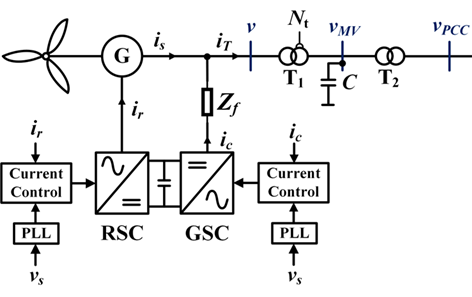
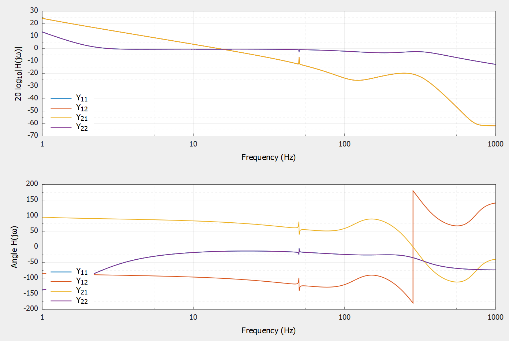

<!--**This model page can be used as template for your own model. If you want to download this page in qmd format, click here:**

<a href="../download/modelTemplate.qmd.txt" download="modelTemplate.qmd">Download model template</a> -->


:::{.callout-tip}
*Type-III wind turbines (`WT3`), also known as DFIG-based turbines, are widely used in grid-connected wind power plants. In this configuration, the generator stator is directly connected to the grid, while the rotor is interfaced through a back-to-back converter, enabling variable-speed operation and flexible active and reactive power control. `WT3` turbines are typically connected to the grid via a medium-voltage collector system and a substation transformer.*
:::

<div style="font-size:1.2em; font-weight:600; color:#1c5d9b; border-left:3px solid #1c5d9b; padding-left:10px; margin-top:1.2em; margin-bottom:0.8em;">
Mathematical Modeling
</div>

---

The type-III WTs are shown in @fig-wt-type3. A type-III wind turbine feeds the grid side through a back-to-back converter. The wind turbine is connected to the MV bus through transformer $T_1$. The current flowing to the MV bus is scaled by $N_t$, representing that a single wind turbine is equivalent to $N_t$ wind turbines connected in parallel @8672500. A capacitor $C$, representing the shunt capacitance of the cable collector, is connected to the MV bus. The MV bus is connected to the PCC through a substation (SS) transformer $T_2$. The PCC is connected to the grid through the cables.

{#fig-wt-type3}

The RSC and GSC are controlled by the current controllers implemented at the d-q domain. Since the outer control loops to generate current references operate much more slowly than the inner current loops, the dynamics of these outer loops can be ignored @8068243. In this sense, the equivalent harmonic impedance model can be developed in @fig-wt3-bode.

{#fig-wt3-bode width=50%}

In @fig-wt3-bode, the grid background harmonics are modeled as a voltage source Vg. Zs represents the shunt reactor. The type-3 wind turbine is modeled as a current disturbance source Id paralleled with a rotor side impedance ZRS and a
grid side impedance ZGS @8068243, @GHANAVATI2021107419, which can be equivalent to a voltage disturbance source Vd in series with the total wind turbine impedance ZDFIG. The disturbance source $V_d$ represents the harmonic components coming from non-ideal PWM of converters, i.e., dead-time and pulse deletion \cite{8672500}. The ZRS includes the rotor machine impedance and the impedance provided by the RSC controller, which is presented as @8068243:

\begin{eqnarray}
Z_{RSP}(s) = \frac{
    sL_{sr} + R_s + \frac{R_r'}{\sigma_p(s)} + \frac{N_2^2}{N_1^2} \frac{H_{ri}(s - j\omega_1) - jK_{rd}}{\sigma_p(s)}
}{   1 - \frac{T_{PLL}(s - j\omega_1)}{2} \left[ \frac{I_{r1}}{V_1} \frac{N_2^2}{N_1^2} \frac{H_{ri}(s - j\omega_1) - jK_{rd}}{\sigma_p(s)} + \frac{V_{r1}}{V_1} \right]
} , \\
Z_{RSn}(s) = 
\frac{
    sL_{sr} + R_s + \frac{R_r'}{\sigma_n(s)} + \frac{N_2^2}{N_r^2} \frac{H_{ri}(s + j\omega_1) + jK_{rd}}{\sigma_n(s)}
}{
    1 - \frac{T_{PLL}(s + j\omega_1)}{2} 
    \left[
        \frac{I_{r1}^*}{V_1^*} \frac{N_2^2}{N_r^2} \frac{H_{ri}(s + j\omega_1) + jK_{rd}}{\sigma_n(s)} 
        + \frac{V_{r1}^*}{V_1^*}
    \right]
},
\end{eqnarray}

where 
\begin{eqnarray}
L_{sr} = L_s + L_r N_{sr}^2, \qquad R'_r = R_r N_{sr}^2, \qquad N_{sr} = \frac{N_s}{N_r}, 
\end{eqnarray}

\begin{equation}
\sigma_{p,n} = \frac{s \mp j\omega_m}{s},
\qquad
H_{ri}(s) = K_{pi} + \frac{K_{ii}}{s}.
\label{eq:sigma_hri}
\end{equation}
       
\begin{equation}
T_{PLL}(s)
=
\frac{
V_1 \left( K_{p,\mathrm{PLL}} + \frac{K_{i,\mathrm{PLL}}}{s} \right)
}{
s + V_1 \left( K_{p,\mathrm{PLL}} + \frac{K_{i,\mathrm{PLL}}}{s} \right)
}.
\label{eq:tpll}
\end{equation}

\begin{equation}
\mathbf{V}_{rs}
=
\mathbf{V}_1
+
\mathbf{I}_{r1}
\left[
j\omega_1 L_{sr}
+
R_s
+
\frac{R'_r}{\sigma_p(j\omega_1)}
\right].
\label{eq:vrs}
\end{equation}

The GSC positive and negative sequence impedances are given with:
\begin{eqnarray}
    Z_{GSp}(s) &= 
\frac{
    Z_f(s) + H_{si}(s - j\omega_1) - jK_{sd}
}{
    1 - \dfrac{T_{PLL}(s-j\omega_1)}{2}
    \left\{
        \dfrac{I_{c1}}{V_1}
        \left[ H_{si}(s-j\omega_1) - jK_{rd} \right]
        + \dfrac{V_{gs}}{V_1}
    \right\}
}
\\
Z_{GSn}(s) &= \frac{
    Z_f(s) + H_{si}(s + j\omega_1) + jK_{sd}
}{    1 - \dfrac{T_{PLL}(s+j\omega_1)}{2}
    \left\{
        \dfrac{I_{c1}^*}{V_1^*}
        \left[ H_{si}(s+j\omega_1) + jK_{rd} \right]
        + \dfrac{V_{gs}^*}{V_1^*}
    \right\}
},
\end{eqnarray}
where
\begin{subequations}
    \begin{eqnarray}
        && H_{si}(s) = K_{sp} + \frac{K_{si}}{s} \\
        &&\mathbf{V}_{gs} = \mathbf{V}_1 + \mathbf{I}_{c1} Z_f(j\omega_1), \\
        &&Z_f(s) = R_f + sL_f.
    \end{eqnarray}
\end{subequations}

The equivalent total admittance is obtained as the parallel connection of the positive and negative sequences from RSC and GSC, like:
\begin{equation}
    Y_{pn} = \begin{bmatrix}
        Y_{RSp} + Y_{GSp} & 0 \\
        0 & Y_{RSn} + Y_{GSn}
    \end{bmatrix},
\end{equation}
and the dq admittance is estimated as:
\begin{equation}
    Y_{dq} = \begin{bmatrix}
        0.5 & 0.5 \\
        -0.5j & 0.5j
    \end{bmatrix} \, Y_{pn} \,
    \begin{bmatrix}
        1 & j \\
        1 & -j
    \end{bmatrix}.
\end{equation}

---

<div style="font-size:1.2em; font-weight:600; color:#1c5d9b; border-left:3px solid #1c5d9b; padding-left:10px; margin-top:1.2em; margin-bottom:0.8em;">
Code Explanation
</div>


<!--
**Example:**

The synchronous machine is one of the most studied component of a power system, being its main source of electrical energy. 
It is the most common type of generators, and it is present in most power plants (thermal, hydro, and some wind) as an interface between the mechanical energy and electrical energy. The mathematical model presented in this article develops the dynamic equations of synchronous machines @DUMMY:1 
It only covers the physical part of the machine (see @sec-physical-description) not the regulations nor protections schemes. 

## Model use, assumptions, validity domain and limitations (mandatory)

*Each model is an approximation of the reality, and considers some assumptions.*

*In this section, details should be given on:*

- *the validity domain of the model (frequency range, type of dynamics, type of stability phenomena) that the model covers,*
- *the model assumptions (e.g., neglecting the DC side of the converter, simplistic PLL representation)*
- *the limitations of the model (what people shouldn't use the model for)*

**Example:**

The model presents the general expressions in abc reference frame of the differential equations that model a general synchronous machine with the following assumptions:
- There are three stator windings ( $a, b, c$) distributed 120º apart one from each other, each of them with equal parameters (i.e. same resistance, inductance...).
- The three phases are balanced, meaning the power is shared equally.
- The rotor has one winding with a field ($e_f$) applied and three damper windings, with no power source, one of them with the axis parallel to the field winding ($1d$) and the other two with a perpendicular axis ($1q,2q$).
- The magnetic field produced by the rotor winding oscillates sinusoidally.
- The machine may have 2 or more poles, noted as $p_f$
The model is suitable for transient stability analysis but not for electromagnetic transient analysis.


## Model description (mandatory){#sec-physical-description}

*This section gives the full description of the different model's components.*
*For each component, is given: a brief explanation about the functioning of the component (how it works, what it is made of, which implementation choices are made) and the component equations or control diagram. The author can also point to another component page if the component is already explained in another page. In such case, he clearly needs to make coherence is achieved with the rest of the model in terms of notation, convention, and connection aspects.*

- _**For the equation system / algorithm :** the author can use Latex language, which is fully compatible with markdown. He can also use numbered equations. The variables and parameters should be clearly specified, as well as their type (complex, real, etc.), unit (MW, MVA, etc), and meaning (phase to neutral voltage for the output terminal A). The notation should follow scientific standards._

- _**Images or Electric/Electronic/Control/Phasor diagramscan be added** for clarity. The image must be of good quality and more preferably in .svg format. Diagrams can be used instead of equations to describe the component. The selected control blocks should be unambiguous, that is to say that their equations should be clearly understood from the diagram. A list of basic blocks can be found in colib here: pages/models/controlBlocks/.  Several packages can be used to display diagrams, e.g.: [draw.io](https://www.drawio.com/) plugin for github allows you to make your own diagram easily. The diagram is fully editable with github commit using a graphical interface, and allowing multiple format outputs (for more details, see: [draw.io github](https://app.diagrams.net/)). _

- _**Initial equations/boundary conditions:** when initial equations or boundary conditions are necessary to fully described the system, a subsection dedicated to those aspects can be added in this section._


**Example:**

### Physical description 

The following schematic shows the components that participate in the synchronous machine operation:

{#fig-SM1 fig-alt="Synchronous machine" width="400px"}

[...]

### Synchronous machine equations

#### Variables 

| Variable    | details  | Unit |
| --------------| ------ | ----- |
| $\theta_{shaft}$ | Rotor angle | $rad$ |
| $\omega$ | Electrical rotational speed | $rad/s$ |
| $T_m$ | Mechanical torque | $Nm$ |
| $T_e$ | Electrical torque | $Nm$ |

[...]

#### Parameters

| Parameter | Description | Unit |
| --- | --- | --- |
| $J$ | Moment of inertia | $kgm^2$ |
| $p_f$ | Number of pole pairs | - |
| $R_a$, $R_b$, $R_c$ | Stator phase resistances | $\Omega$ |

[...]

#### System of equations

The following system of equations describe a general synchronous machine with the considered assumptions. Some of its parameters are generally non-constant, meaning it is not directly solved without making some additional assumptions. The particular models are derivations of this system of equations.

The equations  @eq-inertia, @eq-theta  represent the mechanical dynamic equations:
$$
J\frac{2}{p_f}  \frac{d\omega_m}{dt} = T_m - T_e - T_{fw}
$$  {#eq-inertia}
$$\frac{d\theta_{shaft}}{dt} = \frac{2}{p_f} \omega$$  {#eq-theta}

[...]


## Source code (optional)

_This section is a code section that provides the source code for model described above._

_The code **should correspond strictly the equations/diagram/algorithm described before** and should have been validated in a tool. The date of the code should be specified at the beginning of the section, the code should be clean, readable and organized._

**Example:**
The code can be presented in a **modeling language code block** like this:

```modelica
model VoltageSource "Constant AC voltage"
  extends Interfaces.Source;
  parameter SI.Frequency f(start=1) "Frequency of the source";
  parameter SI.Voltage V(start=1) "RMS voltage of the source";
  parameter SI.Angle phi(start=0) "Phase shift of the source";
equation
  omega = 2*Modelica.Constants.pi*f;
  v = Complex(V*cos(phi), V*sin(phi));
end VoltageSource;
```

## Open source implementations (if any)

_This section give a list of the different open source implementations of this model. It provides the reader with links and languages/software used for each implementations. A markdown table can be used to display such list._

**Example:**

This model has been successfully implemented in :

| Software      | URL | Language | Open-Source License | Last consulted date | Comments |
| --------------| --- | --------- | ------------------- |------------------- | -------- |
| Software name | [Link](https://github.com/toto) | modelica | [MPL v2.0](https://www.mozilla.org/en-US/MPL/2.0/)  | XX/0X/20XX | Comments can contain implementations details such as validation means, implementations key choices, etc. |

## Table of references & license

_This section lists all the references. It must comply with current citation standards. Quarto uses BibTeX for managing reference._


::: {#refs}
:::
-->