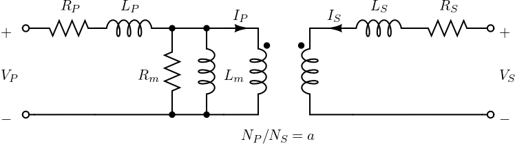

:::{.callout-tip}
*A  `transformer ` is an electrical device that transfers electrical energy between two or more circuits through electromagnetic induction. These transformers are commonly employed in power distribution networks, residential and commercial buildings, and various industrial applications, such as supplying power to lighting systems, heating equipment, and small motors. The possible ratings of single-phase transformers typically range from a few VA (volt-amperes) for small transformers used in electronic applications to several kVA (kilovolt-amperes) for larger transformers in distribution systems.*
:::

## Mathematical Modeling

A single-phase transformer consists of a primary winding and a secondary winding. The voltage and current relationships can be expressed as:
  
  \begin{equation}
  \frac{V_p}{V_s} = \frac{N_p}{N_s} = a \, \exp(j \phi),
  \end{equation}

  \begin{equation}
  -\frac{I_p}{I_s} = \frac{N_p}{N_s} = \frac{1}{a} \, \exp(-j\phi),
  \end{equation}
where the values are: 

   - $V_P$, $I_P$ - primary voltage and current;
   - $V_S$, $I_S$ - secondary voltage  and current;
   - $N_P$, $N_S$ - number of turns in the primary and secondary winding;
   - $a = \frac{N_P}{N_S}$ - turns ratio;
   - $\phi$ - phase shift;
   - $L_P$ and $R_P$ are inductance and resistance of the primary winding;
   - $L_S$ and $R_S$ are inductance and resistance of the secondary winding.
  
  The transformer model is depicted in Fig. @fig-transformer_model

  {#fig-transformer_model fig-alt="Transformer model" width="500px"}

  For the transformer depicted in Fig. @fig-transformer_model, the Y-parameters are as follows:
  \begin{equation}
      Y = \begin{bmatrix}
          \frac{1}{Z_P+\frac{1}{Y_m + \frac{1}{(a \exp(j\phi))^2Z_S}}} & \frac{-(a \exp(j\phi))}{Z_P + (a exp(j\phi))^2Z_S (Y_mZ_P+1)} \\
          \frac{-(a \exp(j\phi))}{Z_P + (a \exp(j\phi))^2Z_S (Y_mZ_P+1)} & \frac{1}{Z_S+\frac{1}{(a \exp(j\phi))^2 \left(Y_m + \frac{1}{Z_P}\right)}}
      \end{bmatrix}.
  \end{equation}

## Code Explanation
