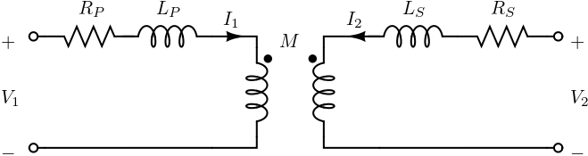

:::{.callout-tip}
*A  `transformer ` is an electrical device that transfers electrical energy between two or more circuits through electromagnetic induction. These transformers are commonly employed in power distribution networks, residential and commercial buildings, and various industrial applications, such as supplying power to lighting systems, heating equipment, and small motors. The possible ratings of single-phase transformers typically range from a few VA (volt-amperes) for small transformers used in electronic applications to several kVA (kilovolt-amperes) for larger transformers in distribution systems.*
:::

## Mathematical Modeling

This transformer model which includes mutual inductance is depicted for a single phase in Fig. @fig-transformer_model It is also considered a classic transformer model. Taking into account modeling from @grainger1999power, the following parameters were used:

{#fig-transformer_model fig-alt="Transformer model" width="500px"}
  
  - $Z_P = R_P + j\omega L_P$ are the primary winding impedances;
  - $Z_S = R_S + j\omega L_S$ are the secondary winding impedances;
  - $M$ are the mutual inductances.

  In this formulation, the admittance matrix accounts for the coupling between the primary and secondary windings, as well as the phase shifts introduced by the transformer configuration. The matrix provides a comprehensive representation of the transformer's electrical characteristics in terms of its admittances and mutual reactances.

  In this case, it is easy to derive Z parameters as:

\begin{equation}
    Z = \begin{bmatrix}
            Z_P & j\omega M \\
            j \omega M & Z_S
    \end{bmatrix}.
\end{equation}

as estimated in @izadian2019laplace page 317. 

## Code Explanation

For detailed code information, see [the Harmony manual](https://github.com/CRESYM/Harmony/tree/main/docs/manual){target="_blank" rel="noopener"}.

## References

::: {#refs}
:::