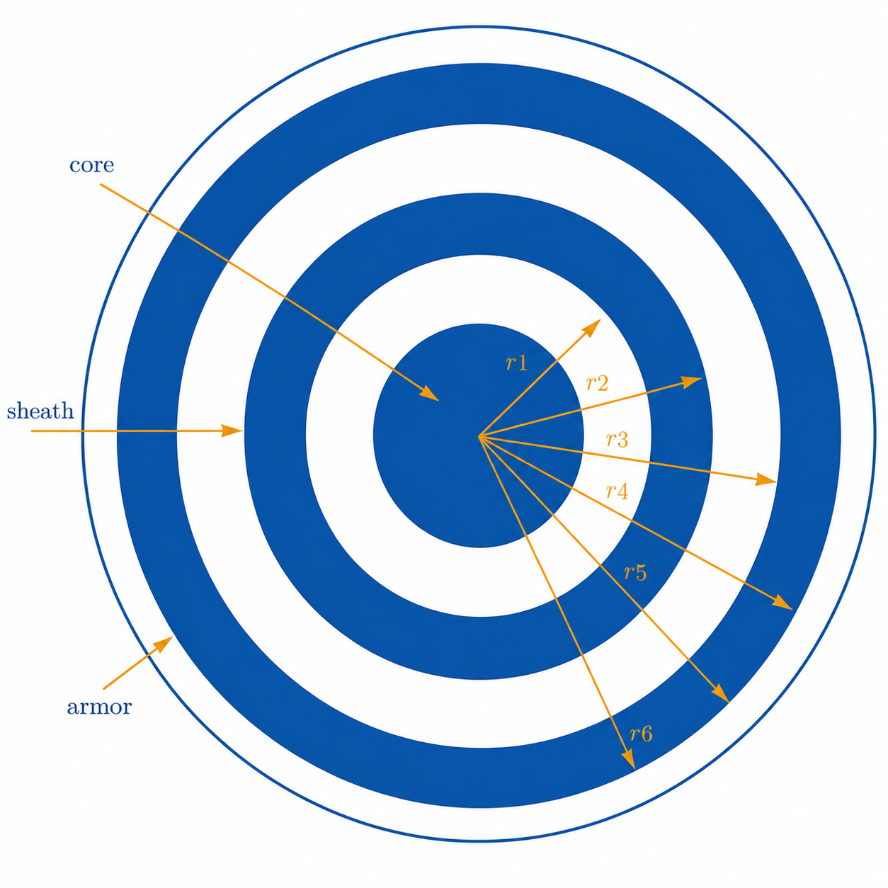

:::{.callout-tip}
*`cable` groups are implemented by focusing on the configurations of the cables available in PSCAD, where a cable can be included either inside the pipe, called pipe-type cables, or placed underground. Cables are usually coaxial with up to 4 layers of both conductors and insulators.*
:::

## Mathematical Modeling

The mathematical formulation adopted for cable modeling follows the classical impedance-based parameter determination approach for coaxial cable systems presented in @ametani1980general @de1987computation @martinez2017powersystem. The implementation in Harmony is also consistent with the methodology adopted in the open-source package PowerImpedanceACDC, which provides impedance-based representations for frequency-domain stability analysis of hybrid AC/DC power systems @powerimpedanceacdc.

Cables can be insulated or pipe-type coaxial cables. At the moment, only a group of coaxial cables is implemented in the package. A cable group consists of $n$ cables, each with a maximum of three conducting layers and three insulation layers, as seen in @fig-cable. The conducting layers of the cable are denoted as the core, sheath, and armor. There are insulators between the conducting layers, except for the last conductor, where the insulator is not a strict necessity but is common. For each conductor, the following set of parameters is given: $r^c_i$ and $r^c_o$ as the conductor's inner and outer radius in meters, conductor relative permeability $\mu^c_r$, and conductor resistivity $\rho_c$ (in [$\Omega$m]). The insulator is described using the following parameters: $r^i_i$ and $r^i_o$ are the insulator's inner and outer radius in meters, $\epsilon^i$ is the insulator's relative permittivity, and $\mu^i_r$ is the insulator's relative permeability.

{#fig-cable width=50%}

### Conductor surface impedance

A hollow conductor surface impedance is given by:
\begin{eqnarray}
\nonumber Z_{aa} = \frac{\rho_c m}{2\pi r^c_i} \, \coth(m(r^c_o - r^c_i)) + \frac{\rho^c}{2\pi r^c_i \, (r^c_i + r^c_o)} \; \left[\frac{\Omega}{\text{m}}\right]  & \mbox{for inner surface}, \\
\nonumber Z_{bb} = \frac{\rho^c m}{2\pi r^c_o} \, \coth(m(r^c_o - r^c_i)) + \frac{\rho^c}{2\pi r^c_o \, (r^c_i + r^c_o)} \; \left[\frac{\Omega}{\text{m}}\right]  & \mbox{for outer surface}, \\
Z_{ab} =  \frac{\rho^c m}{\pi (r^c_i + r^c_o)} \, \operatorname{csch}(m(r^c_o - r^c_i)) \; \left[\frac{\Omega}{\text{m}}\right],
\end{eqnarray}
where $m = \sqrt{j\omega \mu^c_r}$.

For a non-hollow conductor, the outer surface impedance is
\begin{eqnarray}
Z_{bb} = \frac{\rho^c m}{2\pi r^c_o} \, \coth(0.733 mr^c_o) + \frac{0.3179 \rho^c}{\pi {r^c_o}^2} \; \left[\frac{\Omega}{\text{m}}\right].
\end{eqnarray}

The insulator layer between two conductors has an impedance 

\begin{equation}
Z_i = \frac{j\omega \mu_0 \mu^i_r}{2\pi} \, \log\left(\frac{r^i_o}{r^i_i}\right).
\end{equation}

The earth return impedance of the cable and the mutual impedance between cables is

\begin{eqnarray}
Z_g = \frac{j\omega \, \mu_g}{2\pi} \, \left(-\log\left(\frac{\gamma m D}{2}\right) + \frac{1}{2} - \frac{2}{3} \, mH\right),
\end{eqnarray}
for 
\begin{eqnarray}
\nonumber &D = \left\{ \begin{array}{ll}
\sqrt{(x_i - x_j)^2 + (y_i - y_j)^2} & \quad \mbox{for cables } i \neq j, \\
r_i & \quad \mbox{radius of the cable }i,
\end{array} \right. \\
\nonumber &H = \left\{ \begin{array}{ll}
y_i + y_j & \quad \mbox{for cables } i \neq j, \\
2y_i & \quad \mbox{for the cable }i,
\end{array} \right.
\end{eqnarray}
and $\gamma \approx 0.5772156649$ being Euler's constant.

According to @ametani1980general @de1987computation @martinez2017powersystem, one cable is represented by its series impedance $\mathbf{Z}_{ii}$ matrix.

Each matrix $\mathbf{Z}_{ii}$ has the size $n_c \times n_c$ and its entries for $j \in \{1, \ldots, n_c-1\}$ are given by
\begin{eqnarray}
\nonumber \mathbf{Z}_{ii} \left\langle j,j \right\rangle = Z^j_{bb} + Z^j_i + Z^{j+1}_{aa}, \\ 
\nonumber \mathbf{Z}_{ii} \left\langle j,j+1 \right\rangle = \mathbf{Z}_{ii}\left\langle j+1,j \right\rangle = - Z^{j+1}_{ab}, \\ 
\mathbf{Z}_{ii} \left\langle n_c, n_c \right\rangle = Z^{n_c}_{bb} + Z^{n_c}_i + Z^{ii}_g.
\end{eqnarray}
and otherwise, the matrix entries are 0.

Mutual surface impedances between the cables are given by the matrix $\mathbf{Z}_{ij}$ having all components equal to $Z^{ij}_g$.

The shunt admittance matrix can be estimated as $\mathbf{Y} = s\mathbf{P}^{-1}$ and matrix $P$, which has the form
\begin{equation*}
\mathbf{P} = \begin{bmatrix}
\mathbf{P}_{11} & \mathbf{P}_{12} & \cdots & \mathbf{P}_{1n} \\
\vdots & \ddots & & \vdots \\    
\mathbf{P}_{n1} & \mathbf{P}_{n2} & \cdots & \mathbf{P}_{nn}
\end{bmatrix}.
\end{equation*}
Matrices $\mathbf{P}_{ii}$ have components
\begin{equation}
\mathbf{P}_{ii} = \begin{bmatrix}
P_c + P_s + P_a & P_s + P_a & P_a \\
P_s + P_a & P_s + P_a & P_a \\
P_a & P_a & P_a
\end{bmatrix} + 
\begin{bmatrix}
P_{ii} & P_{ii} & P_{ii} \\
P_{ii} & P_{ii} & P_{ii} \\
P_{ii} & P_{ii} & P_{ii}
\end{bmatrix},
\end{equation}
where $P_{c,s,a}$ belong respectively to core, shield and armor insulators and have the following values: $P = \frac{\log(r_o/r_i)}{2\pi\epsilon}$ and $P_{ii} = \frac{\log(2h_i/r)}{2\pi\epsilon_0}$ is an earth return. Matrices $\mathbf{P}_{ij}$, for $i \neq j$, have all components equal to $P_{ij} = \frac{\log(D_2/D_1)}{2\pi\epsilon_0}$, where $D_1 = \sqrt{(x_i-x_j)^2 + (y_i-y_j)^2}$ and $D_2 = \sqrt{(x_i-x_j)^2 + (y_i+y_j)^2}$ @ametani1980general @martinez2017powersystem.

The cable Y parameters are calculated from the distributed-parameter transmission-line formulation:

\begin{eqnarray}
    Y = \begin{bmatrix}
        \textbf{Y}_c \operatorname{coth}(\Gamma l) & -\textbf{Y}_c \operatorname{cosech}(\Gamma l) \\
        -\textbf{Y}_c \operatorname{cosech}(\Gamma l) & \textbf{Y}_c \operatorname{coth}(\Gamma l)
    \end{bmatrix}.
    \label{eq:tl_y_params}
\end{eqnarray}

This formulation is consistent with the implementation strategy adopted in PowerImpedanceACDC @powerimpedanceacdc and the parameter determination methodology summarized in @martinez2017powersystem.

## Code Explanation

For detailed code information, see [the Harmony manual](https://github.com/CRESYM/Harmony/tree/main/docs/manual){target="_blank" rel="noopener"}.