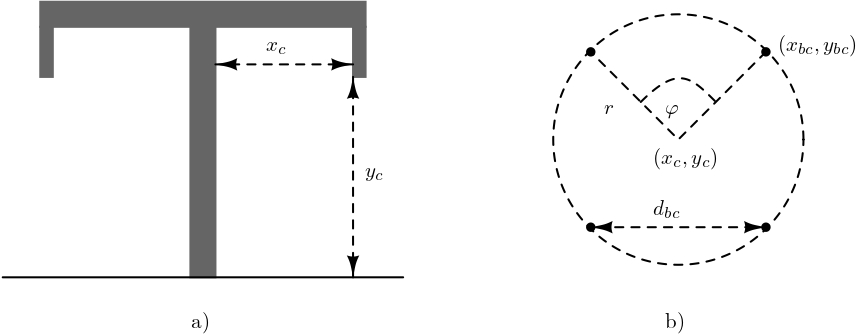

:::{.callout-tip}
*`overhead-line` are widely used in power systems and exhibit strong electromagnetic coupling due to the spatial arrangement of phase conductors and ground wires. Their electrical characteristics are highly dependent on conductor geometry, bundle configuration, and relative positioning with respect to the ground. To accurately capture these effects, a physically based distributed-parameter representation is adopted, in which conductor layouts and material properties are explicitly modeled. This page introduces the geometric configurations and parameter definitions used to construct the overhead transmission line model.*
:::

## Mathematical Modeling

Based on realizations of the transmission line as defined in PSCAD (see @fig-tl-pscad), five possible realizations are defined as:

1. flat (horizontal, which presents a flat configuration without ground wires),
2. vertical,
3. delta (for at least three phases),
4. offset (for at least three phases),
5. concentric (for at least three phases).

Besides, the conductor positions can be added manually as absolute $(x,y)$ positions.

{#fig-tl-pscad width=100%}

Thus, the simulator enables the creation of overhead lines with the conductors having the properties @martinez2017power presented in the table @tbl-ohl-conductors. **Ground wires** have the properties presented in Table @tbl-ohl-groundwires.

| Symbol | Meaning |
|:---:|---|
| $n_b$ | number of bundles (or number of phases) |
| $n_{sb}$ | number of subconductors per bundle |
| $y_{bc}$ | height of the lowest bundle above ground |
| $\Delta y_{bc}$ | vertical offset between bundles |
| $\Delta x_{bc}$ | horizontal offset between the lowest bundles |
| $\Delta \tilde{x}_{bc}$ | horizontal offset in the case of concentric and offset organization |
| $d_{sb}$ | distance between closest subconductors with equidistant concentric organization (symmetric) |
| $d_{sag}$ | maximal sag offset |
| $r_c$ | radius of the conductor |
| $R_{dc}$ | DC resistance of the conductor |
| $g_c$ | shunt conductance of the conductor |
| $\mu_{r,c}$ | relative permeability of the conductor |
| positions | added manually |
| organization | can be flat, vertical, concentric, delta, and offset |

: OHL conductor parameters {#tbl-ohl-conductors}

The transmission line model is constructed using the procedure from @martinez2017power and in following the previously developed code of the project authors \cite{PowerImpedanceACDC2025}. The overhead transmission line consists of $n_b$  including sub-conductors, stranding, etc. and $n_g$ ground wires. 

| Symbol        | Meaning                                                     |
|---------------|-------------------------------------------------------------|
| $n_g$         | number of ground wires                                      |
| $\Delta x_g$  | relative horizontal distance between ground wires           |
| $\Delta y_g$  | relative vertical distance between ground wires and the lowest conductors |
| $r_g$         | radius of the ground wire                                   |
| $d_{g,sag}$   | ground wire sag                                             |
| $R_{g,dc}$    | DC resistance of the ground wires                           |
| $\mu_{r,g}$   | relative permeability of the ground wire                   |

: OHL ground wire parameters {#tbl-ohl-groundwires}

The transmission line model is constructed using the procedure from @martinez2017power and in following the previously developed code of the project authors @PowerImpedanceACDC2025. The overhead transmission line consists of $n_b$  including sub-conductors, stranding, etc. and $n_g$ ground wires. 

Each line/conductor positioned as $x_c$ relatively starting from the central tower position and $y_c$ vertically, measured from ground, with the sag at the midpoint between towers $d_{sag}$, see @fig-tl. Thus, the modified vertical position is used in calculations as $\hat{y}_c = y_c - \frac{2}{3} \, d_{sag}$. The conductor is formed using $n_{sb}$ sub-conductors grouped in the bundle, where all sub-conductors are grouped using a symmetrical equidistant pattern with the distance between the two nearest sub-conductors being $d_{bc}$, or a bundle spacing. Using conductor position, the position of the each sub-conductor can be estimated. Knowing the angle between two sub-conductors on the circle and its radius

\begin{eqnarray}
\nonumber \varphi = \frac{360^\circ}{n_{sb}}, \\
r = \frac{d_{sb}}{2 \sin(\varphi/2)}, 
\end{eqnarray} 
the position can be estimated starting from the angle $\varphi_s = \frac{\pi}{2}$ if the number of sub-conductors is odd, or from $\varphi_s = \frac{\pi + \varphi}{2}$ for an even number of sub-conductors, as follows:
\begin{eqnarray}
\nonumber x_{bc} = x_c + r \cos(\varphi_s + k \, \varphi), \\
y_{bc} = y_c + r \sin(\varphi_s + k \, \varphi) - \frac{2}{3} \, d_{sag}, 
\end{eqnarray}

for $k \in \{1, 2, ..., n_{bc}\}$. If the number of sub-conductors is equal to one, its position is given by $(x_c, \hat{y}_c)$.
Each conductor is characterized by the relative permeability of the material $\mu_r$, the conductor dc resistance $R_{dc}$, and the radius $r_i$.
  
Ground wires are modeled similarly, represented with their relative position $(x_g,y_g)$, radius $r_g$, dc resistance $R_{gdc}$, and relative permeability of the material $\mu_r$.

Earth parameters are given with permeability $\mu_e$, permittivity $\epsilon_e$ and conductivity $\rho_e$.

The characteristic impedance describes the ratio of voltage to current for a wave traveling along the transmission line, while the propagation constant describes how the wave attenuates and changes phase as it propagates along the line.

To represent the transmission line using ABCD parameters, it is necessary to calculate series impedance and shunt admittance matrices @martinez2017power. Both matrices are of the size $n \times n$, where $n = \sum\limits_{i=1}^{n_c} n^i_{bc} + n_g$. The impedance matrix has the following form:

\begin{eqnarray}
\mathbf{Z} = \operatorname{diag}(Z_i) + 
\begin{bmatrix}
Z_{0,11} & \cdots & Z_{0,1n} \\
\vdots & \ddots & \vdots \\
Z_{0,n1} & \cdots & Z_{0,nn}
\end{bmatrix}
\end{eqnarray}
where $Z_i = \frac{m\rho_i}{2\pi r_i} \, \coth(0.733mr_i) + \frac{0.3179 \rho_i}{\pi r_i^2}$ for the $i$-th conductor/sub-conductor/ground wire and $r_i$ is its radius, resistivity $\rho_i = R^i_{dc} \, \pi r_i^2$ and $m = \sqrt{j\omega \,\frac{\mu_0 \mu_{r,i}}{\rho_i}}$; The components $Z_{0, ij} = \frac{j\omega \, \mu_0}{2\pi} \, \log\left( \frac{\hat{D}_{ij}}{d_{ij}}\right)$ for 
\begin{eqnarray}
\nonumber &d_{ij} = \left\{\begin{array}{ll}
\sqrt{(x_i-x_j)^2 + (y_i-y_j)^2}, & \quad i \neq j, \\
r_i, & \quad i = j,
\end{array} \right. \\
\nonumber &D_{ij} = \left\{\begin{array}{ll}
\sqrt{(x_i-x_j)^2 + (y_i+y_j)^2}, & \quad i \neq j, \\
2y_i, & \quad i = j,
\end{array} \right. \\
\nonumber &\hat{D}_{ij} = \sqrt{(y_i + y_j + 2d_e)^2 + (x_i-x_j)^2}, \\
&d_e = \sqrt{\frac{1}{j\omega \, \mu_e (\sigma_e + j\omega \, \epsilon_e)}}.
\end{eqnarray}

The shunt admittance is a matrix formed as
\begin{equation}
\mathbf{Y} = s \, \mathbf{P}^{-1} + \mathbf{G}
\end{equation}
from matrix $\mathbf{P}$ with its components $\mathbf{P}_{ij} = \frac{1}{2\pi\epsilon_0} \, \log\left( \frac{D_{ij}}{d_{ij}}\right)$ and $\mathbf{G} = \operatorname{diag}\{g_c\}$.

The ABCD parameters of a transmission line can be defined as \cite{castellanos1997full, morched1999universal}
\begin{equation}
\begin{bmatrix}
\mathbf{A} & \mathbf{B} \\
\mathbf{C} & \mathbf{D}
\end{bmatrix} =
\begin{bmatrix}
\cosh(\Gamma l) & \mathbf{Y}_c^{-1}\sinh(\Gamma l) \\
\mathbf{Y}_c \sinh(\Gamma l) &  \cosh(\Gamma l)
\end{bmatrix}
\label{eq_tl_abcd}
\end{equation}
where $\mathrm{\Gamma} = \sqrt{\mathbf{Z}\mathbf{Y}}$ and $\mathbf{Y}_c = \mathbf{Z}^{-1} \, \Gamma$, and $l$ standing for the line or cable length. The formula used is based on the frequency-dependent phase domain model.

Y parameters: The ABCD parameters of a transmission line can be defined as @630478, @772350

\begin{equation}
\begin{bmatrix}
\mathbf{A} & \mathbf{B} \\
\mathbf{C} & \mathbf{D}
\end{bmatrix} =
\begin{bmatrix}
\cosh(\Gamma l) & \mathbf{Y}_c^{-1}\sinh(\Gamma l) \\
\mathbf{Y}_c \sinh(\Gamma l) &  \cosh(\Gamma l)
\end{bmatrix}
\end{equation}

where $\mathrm{\Gamma} = \sqrt{\mathbf{Z}\mathbf{Y}}$ and $\mathbf{Y}_c = \mathbf{Z}^{-1}\,\Gamma$, and $l$ standing for the line or cable length. The formula used is based on the frequency-dependent phase domain model.

From them Y parameters calculate as follows \cite{leterme2020parameters}:
\begin{eqnarray}
    Y = \begin{bmatrix}
        \textbf{Y}_c \operatorname{coth}(\Gamma l) & -\textbf{Y}_c \operatorname{cosech}(\Gamma l) \\
        -\textbf{Y}_c \operatorname{cosech}(\Gamma l) & \textbf{Y}_c \operatorname{coth}(\Gamma l)
    \end{bmatrix}.
\end{eqnarray}

{#fig-tl width=75%}

## Code Explanation

## References

::: {#refs}
:::