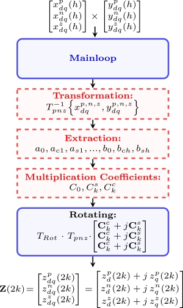
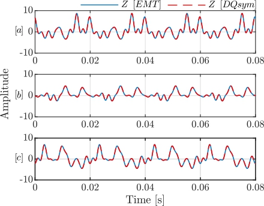
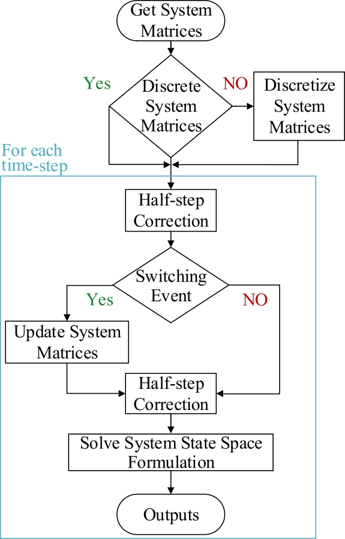

<!--**This model page can be used as template for your own model. If you want to download this page in qmd format, click here:**

<a href="../download/modelTemplate.qmd.txt" download="modelTemplate.qmd">Download model template</a> -->


:::{.callout-tip}
*DQSym is founded on dynamic phasor theory, which represents periodic electrical variables using time-varying Fourier coefficients. By transforming three-phase quantities into a structured phasor domain, it captures both fundamental-frequency dynamics and harmonic interactions in hybrid AC/DC systems. This formulation enables systematic modeling and small-signal stability analysis of modern power systems with high penetration of power electronics.*
:::

## Dynamic Phasor Theory

DPs express signals in a complex-valued, frequency-shifted form that captures both amplitude and phase variations over time. A DP is defined as a time-varying Fourier coefficient obtained through a linear transformation of a band-limited signal. This transformation is realized by projecting the signal onto complex exponential basis functions over a sliding time window, thereby enabling a compact time-frequency representation~\cite{n19}.  
For a nearly periodic waveform $x(\tau)$ defined over the interval $(t-T,\,t)$, the signal can be expressed using a Fourier series expansion as
\begin{equation}
    x(\tau) = \sum_{k=-\infty}^{\infty} X_k(t) e^{j k \omega_c \tau},
    \label{eq:dp_series}
\end{equation}
where $\omega_c = \tfrac{2\pi}{T}$ is the fundamental frequency and $X_k(t)$ denotes the $n^{\text{th}}$ DP. Each coefficient varies with time to capture localized spectral content and is computed as
\begin{equation}
    X_k(t) = \frac{1}{T} \int_{t-T}^{t} x(\tau) e^{-j k \omega_c \tau} \, d\tau = \langle x \rangle_k(t),
    \label{eq:dp_coeff}
\end{equation}
which formally defines the DP as a time-localized projection of the signal.  

The dimensionality of a DP model grows with the number of harmonics $k$ included. However, under steady-state conditions, the coefficients converge to constant (DC-like) values, yielding a time-invariant representation that facilitates analysis.  

An alternative representation to the complex valued is obtained by representing any arbitrary bandpass signal in terms of its amplitude $A_n(t)$, phase $\theta_n(t)$, and fundamental frequency $\omega_c$:
\begin{equation}
    x(t) = a_0 + \sum_{n=1}^{k} A_n(t)\cos(n \omega_c t + \theta_n(t)),
\end{equation}
where $a_0$ is the DC component. This signal can be decomposed into \textit{in-phase} and \textit{quadrature} components as:
\begin{equation}
    x(t) = a_0 + \sum_{n=1}^{k} x_{In}(t)\cos(n \omega_c t) - x_{Qn}(t)\sin(n \omega_c t),
\end{equation}
with
\begin{equation}
    x_{In}(t) = A_n(t)\cos(\theta_n(t)), \quad x_{Qn}(t) = A_n(t)\sin(\theta_n(t)).
\end{equation}

From these components, a complex-valued variable can be constructed to represent the DP at $k^{\text{th}}$ harmonic order \cite{n51}:
\begin{equation}
    \langle x \rangle_n(t) = x_{In}(t) + j x_{Qn}(t) = A_n(t)e^{j\theta_n(t)}.
    \label{eq:118}
\end{equation}
The original signal can then be recovered by remodulating with $e^{j n \omega_c t}$ and taking the real part:
\begin{align}
    x(t) &= \Re\left\{\langle x \rangle_n(t)e^{j n \omega_c t}\right\} = A_n(t)\cos(n\omega_c t + \theta_n(t)).
\end{align}

DPs also possess several mathematical properties, obtained through their link to Fourier series, that make them particularly suitable for system modeling and analysis:

- **Time derivative:**

  $$
  \frac{d \langle x \rangle_k}{dt}
  =
  \left\langle \frac{dx}{dt} \right\rangle_k
  -
  j k \omega_c \langle x \rangle_k
  $$

- **Multiplication:**

  $$
  \langle xy \rangle_k(t)
  =
  \sum_i
  \langle x \rangle_{k-i}(t)\,
  \langle y \rangle_i(t)
  $$

- **Complex conjugate:**

  $$
  \langle x \rangle_{-k}(t)
  =
  \langle x \rangle_k^*(t)
  $$

These properties enable the construction of DP models with an arbitrary number of harmonics, offering a compact yet flexible representation of systems with rich spectral content. However, including higher-order harmonics increases the computational burden. Thus, a key factor in practical applications is the appropriate selection of Fourier coefficients $k$, balancing model accuracy against simulation efficiency.

## Proposed Framework
This section presents the $DQsym$ framework,  beginning with the mathematical foundation of DPs, followed by the state-space formulation and its integration into $DQsym$ framework.

### Transformation of Dynamic Phasor Quantities from $abc$ to DQ-pnz Frame
As stated DPs ($X_k(t)$) are time-varying Fourier coefficients, slowly varying when the signal is near-periodic around a base frequency. Their in-phase ($x_I(t)=\Re\{X_k(t)\}$) and quadrature ($x_Q(t)=\Im\{X_k(t)\}$) components are orthogonal, which allows each phasor to represent a specific $k^{\text{th}}$ harmonic without coupling formation with other harmonic DPs. These properties form the basis for transforming DP quantities from the $abc$ frame to the rotating $dq0$ frame.

Considering a general three-phase signal $\vec{x}_{abc}(t) = \begin{bmatrix} x_a(t) & x_b(t) & x_c(t) \end{bmatrix}^T, \label{eq:xabc}$
which may be time-varying and unbalanced, applying the classical symmetrical component transformation $T_{pnz}$, the three-phase signals are decomposed into positive-, negative-, and zero-sequence components:
\begin{equation}
    \vec{x}_{pnz}(t) = T_{pnz} \cdot\vec{x}_{abc}(t) = \vec{x}_{p}(t) + \vec{x}_{n}(t) + \vec{x}_{z}(t),
    \label{eq:xabc_total2}
\end{equation}

where
\begin{equation}
T_{pnz}
=
\frac{1}{3}
\begin{bmatrix}
1 & a & a^2 \\
1 & a^2 & a \\
1 & 1 & 1
\end{bmatrix},
\quad a = e^{j \tfrac{2\pi}{3}}.
\end{equation}

In order to describe it in a simpler manner, let us assume that signal $\vec{x}_{abc}(t)$ is a sinusoid with amplitude $X_i(t)$ and phase $\theta_i(t)$, $i \in \{a,b,c\}$, displaced by $120^\circ$:
\begin{equation}
\begin{bmatrix}
    x_{a}\\
    x_{b}\\
    x_{c}
\end{bmatrix}
=
\begin{bmatrix}
        X_a(t)\cos(\omega t + \theta_{a}(t)) \\
        X_b(t)\cos\left(\omega t + \theta_{b}(t) - \tfrac{2\pi}{3} \right) \\
        X_c(t)\cos\left(\omega t + \theta_{c}(t) + \tfrac{2\pi}{3} \right)
    \end{bmatrix}.
\label{realvalued}
\end{equation}
Then, based on equation \eqref{eq:xabc_total2}, each component can be expressed as
\begin{equation}
\vec{x}_{j}(t) = X_{j} \cdot 
    \begin{bmatrix}
        \cos(\omega t + \theta_{j}) \\
        \cos\left(\omega t + \theta_{j} + i \tfrac{2\pi}{3} \right) \\
        \cos\left(\omega t + \theta_{j} - i \tfrac{2\pi}{3} \right)
    \end{bmatrix}, \\
    i = 
    \begin{cases}
        -1, & j = p \\
        1,  & j = n \\
        0,  & j = z
    \end{cases}.
\label{eq:sequence_components1}
\end{equation}

or equivalently in phasor form \cite{n4}:
\begin{equation}
\vec{x}_{j}(t) = X_j \cdot
\begin{bmatrix}
e^{j(\omega t + \theta_j)} \\
e^{j(\omega t + \theta_j +  \tfrac{2i\pi}{3})} \\
e^{j(\omega t + \theta_j - \tfrac{2i\pi}{3})}
\end{bmatrix}.
\label{eq:phasor_components}
\end{equation}

Mapping the three-phase system into the stationary $\alpha\beta0$ frame using Clarke transformation as:
\begin{equation}
    \vec{x}_{\alpha\beta0,j}(t) = T_c \cdot \vec{x}_{j}(t),\quad 
    T_c = \frac{2}{3}
\begin{bmatrix}
1 & -\tfrac{1}{2} & -\tfrac{1}{2} \\
0 & \tfrac{\sqrt{3}}{2} & -\tfrac{\sqrt{3}}{2} \\
\tfrac{1}{2} & \tfrac{1}{2} & \tfrac{1}{2}
\end{bmatrix},
\label{eq:alphbetaclark}
\end{equation}
which is in complex form:
\begin{equation}
\begin{bmatrix}
x_{\alpha\beta,p} \\
x_{\alpha\beta,n} \\
x_{0,z}
\end{bmatrix}
=
\begin{bmatrix}
X_p e^{j(\omega t + \theta_p)} \\
X_n e^{-j(\omega t + \theta_n)} \\
X_z e^{j(\omega t + \theta_z)}
\end{bmatrix}.
\label{eq:alphabetaincomplex}
\end{equation}

Extracting the DPs requires a frequency shift @n4:
\begin{equation}
    \begin{bmatrix}
    \langle x_{\alpha\beta,p} \rangle \\
    \langle x_{\alpha\beta,n} \rangle \\
    \langle x_{0,z} \rangle
\end{bmatrix}
=
\begin{bmatrix}
    X_p e^{j\theta_p} \\
    X_n e^{-j\theta_n} \\
    X_z e^{j\theta_z}
\end{bmatrix}.
\label{eq:alphabetadps}
\end{equation}

The negative-sequence phasor may equivalently be expressed in a positively rotating frame:$\langle x_{\alpha\beta,n} \rangle = \langle x_{\alpha\beta,n} \rangle^* = X_n e^{j\theta_n}.$

Finally, the Park transformation rotates the $\alpha\beta0$ components into the $dq0$ frame:
\begin{equation}
    \begin{bmatrix}
    \langle x_{dq,p} \rangle_k \\
    \langle x_{dq,n} \rangle_k \\
    \langle x_{dq,z} \rangle_k
\end{bmatrix}
=
\begin{bmatrix}
    e^{-j\theta} & 0 & 0 \\
    0 & e^{-j\theta} & 0 \\
    0 & 0 & 1
\end{bmatrix}
\begin{bmatrix}
    \langle x_{\alpha\beta,p} \rangle_k \\
    \langle x_{\alpha\beta,n} \rangle_k^* \\
    \langle x_{0,z} \rangle_k
\end{bmatrix}.
\end{equation}

Thus, in DP form is:
\begin{equation}
    \begin{bmatrix}
    \langle x_{dq,p} \rangle_k \\
    \langle x_{dq,n} \rangle_k \\
    \langle x_{dq,z} \rangle_k
\end{bmatrix}
=
\begin{bmatrix}
    X^p_k e^{j\theta^p_k} \\
    X^n_k e^{j\theta^n_k} \\
    X^z_k e^{j\theta^z_k}
\end{bmatrix}
=
\begin{bmatrix}
\mathbf{x}_d^{p}(k) + j \mathbf{x}_q^{p}(k) \\
\mathbf{x}_d^{n}(k) + j \mathbf{x}_q^{n}(k) \\
\mathbf{x}_d^{z}(k) + j \mathbf{x}_q^{z}(k)
\end{bmatrix}.
\label{eq:finaldpqn}
\end{equation}

\cite{n4} shows that this procedure maps DPs in the $abc$ frame into the $dq0$ frame by (i) applying the symmetrical component transformation, and (ii) rotating the positive- and negative-sequence phasors by $-\theta$ (multiplication by $e^{-j\theta}$ in complex form). Below equation summarizes this transformation: DPs are first constructed in the $abc$ frame using in-phase and quadrature coefficients ($C^c$ and $C^s$), then transformed into symmetrical components, and finally rotated into the $dq0$ frame.

\begin{equation}
\begin{split}
& \begin{bmatrix}
\mathbf{C}_{k}^{c} + j \mathbf{C}_{k}^{s} \\
\mathbf{C}_{k}^{c} + j \mathbf{C}_{k}^{s} \\
\mathbf{C}_{k}^{c} + j \mathbf{C}_{k}^{s}
\end{bmatrix}
=
\begin{bmatrix}
    \langle x_{a} \rangle_k \\
    \langle x_{b} \rangle_k \\
    \langle x_{c} \rangle_k
\end{bmatrix}
\xRightarrow{T_{pnz}}
\begin{bmatrix}
    \langle x_{\alpha\beta,p} \rangle_k \\
    \langle x_{\alpha\beta,n} \rangle_k^* \\
    \langle x_{0,z} \rangle_k
\end{bmatrix},\\&
\begin{bmatrix}
    e^{-j\theta} & 0 & 0 \\
    0 & e^{-j\theta} & 0 \\
    0 & 0 & 1
\end{bmatrix}
\begin{bmatrix}
    \langle x_{\alpha\beta,p} \rangle_k \\
    \langle x_{\alpha\beta,n} \rangle_k^* \\
    \langle x_{0,z} \rangle_k
\end{bmatrix} \Rightarrow
    \begin{bmatrix}
    \langle x_{dq,p} \rangle_k \\
    \langle x_{dq,n} \rangle_k \\
    \langle x_{dq,z} \rangle_k
\end{bmatrix}
\label{eq:111}
\end{split}
\end{equation}

## Mathematical Operation
The following set of mathematical operations---summation, multiplication, and integration---form the basis of the DQsym approach and enable its application to full system simulations.

## Summation
Summing DPs in $dq0$ form adheres to complex-number rules with no change in the form of the inputs or additional operations needed (i.e. simple elementwise additivity), as follows:

\begin{equation}
\begin{split}
\begin{bmatrix}
\mathbf{x}^{p}(0) & \cdots & \mathbf{x}^{p}(n)\\
\mathbf{x}^{n}(0) & \cdots & \mathbf{x}^{n}(n)\\
\mathbf{x}^{z}(0) & \cdots & \mathbf{x}^{z}(n)
\end{bmatrix}
&+
\begin{bmatrix}
\mathbf{y}^{p}(0) & \cdots & \mathbf{y}^{p}(n)\\
\mathbf{y}^{n}(0) & \cdots & \mathbf{y}^{n}(n)\\
\mathbf{y}^{z}(0) & \cdots & \mathbf{y}^{z}(n)
\end{bmatrix}
\\&=
\begin{bmatrix}
\mathbf{z}^{p}(0) & \cdots & \mathbf{z}^{p}(n)\\
\mathbf{z}^{n}(0) & \cdots & \mathbf{z}^{n}(n)\\
\mathbf{z}^{z}(0) & \cdots & \mathbf{z}^{z}(n)
\end{bmatrix}
\end{split}
\end{equation}
where  $z^{p,n,z}_{d,q}(i) = x^{p,n,z}_{d,q}(i) + y^{p,n,z}_{d,q}(i)$, for $i \in \{0, \ldots, n\}$.

## Multiplication
Any time-varying signal can be represented as an infinite sum of sine and cosine functions at integer multiples of the fundamental frequency $\omega_{c}$, and each sinusoid $\sin(n\omega_c t)$ or $\cos(n\omega_c t)$ corresponds to the $n^{\text{th}}$ harmonic of $x(t)$. This expansion is known as the trigonometric Fourier series of $x(t)$, with coefficients $a_n$ and $b_n$ denoting the Fourier sine and cosine coefficients. The coefficient $a_0$ represents the DC component (average value) of the signal, while $a_n$ and $b_n$ ($n \neq 0$) define the amplitudes of the sinusoidal terms that constitute the AC component:

\begin{equation}
\begin{split}
    x(t) &= a_0 + a_1 \cos \omega_0 t + b_1 \sin \omega_0 t + a_2 \cos 2\omega_0 t \\
     &\quad + b_2 \sin 2\omega_0 t + a_3 \cos 3\omega_0 t + b_3 \sin 3\omega_0 t + \cdots 
\end{split}
\end{equation}

or 

\begin{equation}
x(t) = \underbrace{a_0}_{\text{dc}} + \underbrace{\sum_{n=1}^{\infty} \left( a_n \cos n\omega_0 t + b_n \sin n\omega_0 t \right)}_{\text{ac}} .
\end{equation}

When two harmonic-rich signals are multiplied, the resulting product contains additional frequency components.

### Theorem

The product of two periodic signals with fundamental frequency $\omega$ represented by a truncated Fourier series of order $N$:

\begin{equation}
x(t) = a_0 + \sum_{i=1}^{N} \left( a_i^s \sin(i\omega t) + a_i^c \cos(i\omega t) \right),
\end{equation}

\begin{equation}
y(t) = b_0 + \sum_{j=1}^{N} \left( b_j^s \sin(j\omega t) + b_j^c \cos(j\omega t) \right).
\end{equation}

denoted as $z(t) = x(t)y(t)$ can be expressed as

\begin{equation}
z(t) = C_0 + \sum_{k=1}^{2N} \left( C_k^s \sin(k\omega t) + C_k^c \cos(k\omega t) \right),
\label{eq:SICOprodcut}
\end{equation}

\begin{equation}
C_0 = a_0 b_0 + \sum_{i=1}^N \left( \tfrac{1}{2} a_i^s b_i^s + \tfrac{1}{2} a_i^c b_i^c \right),
\label{eq:C0}
\end{equation}

\begin{equation}
C_k^s =
\sum_{\substack{i+j = k \\ 1 \leq i,j \leq N}} \tfrac{1}{2} \left( a_i^s b_j^c + a_i^c b_j^s \right)
+ \sum_{\substack{|i-j| = k \\ 1 \leq i,j \leq N}}
\Big[
\tfrac{1}{2}\big( \operatorname{sgn}(i-j) a_i^s b_j^c - \operatorname{sign}(i-j) a_i^c b_j^s \big)
+\, a_0 b_k^s + b_0 a_k^s
\Big],
\label{eq:Cs}
\end{equation}

\begin{equation}
C_k^c =
\sum_{\substack{i+j = k \\ 1 \leq i,j \leq N}} \tfrac{1}{2} \left( a_i^c b_j^c - a_i^s b_j^s \right)
+ \sum_{\substack{|i-j| = k \\ 1 \leq i,j \leq N}}
\Big[
\tfrac{1}{2}\big( a_i^c b_j^c + a_i^s b_j^s \big)
+ a_0 b_k^c + b_0 a_k^c
\Big],
\label{eq:Cc}
\end{equation}

### Proof

The validity of the coefficient expressions in \eqref{eq:C0}, \eqref{eq:Cs}, and \eqref{eq:Cc} can be established using mathematical induction on the harmonic order $N$. Let us check the correctness of the coefficient for:

#### Base Case $N=0$

For constant signals

\begin{equation*}
x(t) = a_0, \quad y(t) = b_0,
\end{equation*}

the product is $z(t) = a_0 b_0$,

which implies

\begin{equation*}
C_0 = a_0 b_0, \quad C_k^s = 0, \quad C_k^c = 0.
\end{equation*}

Thus, \eqref{eq:C0}, \eqref{eq:Cs}, and \eqref{eq:Cc} hold for $N=0$.


#### Base Case $N=1$

For first-order expansions

\begin{align*}
x(t) &= a_0 + a_1^s \sin(\omega t) + a_1^c \cos(\omega t), \\
y(t) &= b_0 + b_1^s \sin(\omega t) + b_1^c \cos(\omega t),
\end{align*}

their product is

\begin{align*}
z(t) &= x(t)y(t) \nonumber \\
&= a_0 b_0 + a_0 b_1^s \sin(\omega t) + a_0 b_1^c \cos(\omega t) \nonumber \\
&\quad + b_0 a_1^s \sin(\omega t) + b_0 a_1^c \cos(\omega t) \nonumber \\
&\quad + a_1^s b_1^s \sin^2(\omega t) + a_1^c b_1^c \cos^2(\omega t) \nonumber \\
&\quad + (a_1^s b_1^c + a_1^c b_1^s) \sin(\omega t)\cos(\omega t).
\end{align*}

Using trigonometric identities,

\begin{align*}
&& \sin(i\omega t) \sin (j\omega t) = \tfrac{1}{2}(\cos((i-j)\omega t) - \cos((i+j)\omega t)), \\
&& \cos(i\omega t) \cos(j\omega t) = \tfrac{1}{2}(\cos((i-j)\omega t) + \cos((i+j)\omega t)), \\
&& \sin(i\omega t)\cos(j\omega t) = \tfrac{1}{2}(\sin((i+j)\omega t) + \sin((i-j)\omega t)),
\end{align*}

we group the terms as

\begin{align*}
z(t) &= \underbrace{\Big(a_0 b_0 + \tfrac{1}{2}a_1^s b_1^s + \tfrac{1}{2}a_1^c b_1^c\Big)}_{C_0} \nonumber \\
&\quad + \underbrace{(a_1^s b_0 + a_0 b_1^s)}_{C_1^s}\sin(\omega t) + \underbrace{(a_1^sb_0 + a_0b_1^s)}_{C_1^c}\cos(\omega t) \nonumber \\
&\quad + \underbrace{\frac{1}{2}(a_1^sb_1^c + a_1^cb_1^s)}_{C_2^s}\sin(2\omega t) + \underbrace{\frac{1}{2}(a_1^cb_1^c - a_1^sb_1^s)}_{C_2^c}\cos(2\omega t),
\end{align*}

where the coefficients are consistent with the structure given in \eqref{eq:C0}, \eqref{eq:Cs}, and \eqref{eq:Cc}. Thus, the case $N=1$ is verified.


### Induction Step

Assume that \eqref{eq:C0}, \eqref{eq:Cs}, and \eqref{eq:Cc} holds for Fourier series truncated at order $N$:

\begin{align}
x'(t) &= a_0 + \sum_{i=1}^N \big( a_i^s \sin(i\omega t) + a_i^c \cos(i\omega t) \big), \\
y'(t) &= b_0 + \sum_{j=1}^N \big( b_j^s \sin(j\omega t) + b_j^c \cos(j\omega t) \big),
\end{align}

with $z'(t) = x'(t)y'(t)$ satisfies the equation \eqref{eq:C0}, \eqref{eq:Cs}, and \eqref{eq:Cc}, denoted with $C'_0$, ${C_k^{s}}'$ and ${C^{c}_k}'$, for $k \in \{1, \ldots 2N\}$, respectively.

Now we have to show that it is valied for $N+1$, so we extend $x(t)$ and $y(t)$ with the $(N+1)$-th harmonics:

\begin{equation}
\begin{split}
x(t) &= x'(t) + \underbrace{a_{N+1}^s \sin((N+1)\omega t) + a_{N+1}^c \cos((N+1)\omega t)}_{x^{(N+1)}(t)}, \\
y(t) &= y'(t) + \underbrace{b_{N+1}^s \sin((N+1)\omega t) + b_{N+1}^c \cos((N+1)\omega t)}_{y^{(N+1)}(t)}
\end{split}
\end{equation}

The product expands as

\begin{align*}
&&z(t) = x(t)y(t) = x'(t)y'(t) + x'(t) \, y^{(N+1)}(t)\nonumber \\
&&\quad + y'(t)x^{(N+1)}(t) + x^{(N+1)}(t)y^{(N+1)}(t).
\end{align*}

The first and last terms yield valid Fourier series with harmonics up to order $2N$ and $2N+2$. Thus, the term $C_0$ is only influenced by $x'(t)y'(t)$ and $x^{(N+1)}(t)y^{(N+1)}(t)$, and equal to:

\begin{align*}
C_0 &= C_0'+ \frac{1}{2}(a_{N+1}^s b_{N+1}^s + a_{N+1}^c b_{N+1}^c) \\
& = a_0 b_0 + \sum_{i=1}^{N+1} \left( \tfrac{1}{2} a_i^s b_i^s + \tfrac{1}{2} a_i^c b_i^c \right),
\end{align*}

and corresponds to the equation \eqref{eq:C0}.

The multiplication cross-terms introduce frequencies of the form $j = i \pm (N+1)$, where $1 \leq i \leq N$, generating harmonics up to $(2N+1)\omega$. Namely, we obtain that:

\begin{align*}
&x'y^{(N+1)} =\\
&= a_0 b_{N+1}^s \sin((N+1)\omega t) + a_0 b^c_{N+1} \cos((N+1)\omega t) \\
& \sum_{i=1}^{N} \left(\frac{1}{2} (a_i^c b_{N+1}^c - a_i^s b_{N+1}^s) \cos((N+1+i)\omega t) \right.\\
& + \frac{1}{2} (a_i^c b_{N+1}^c + a_i^s b_{N+1}^s) \cos((N+1-i)\omega t) \\
& + \frac{1}{2} (a_i^c b_{N+1}^s + a_i^s b_{N+1}^c) \sin((N+1+i)\omega t) \\
& + \left.\frac{1}{2} (a_i^c b_{N+1}^s - a_i^s b_{N+1}^c) \sin((N+1-i)\omega t)\right),
\end{align*}

and

\begin{align*}
&y'x^{(N+1)} = \\
&= b_0 a_{N+1}^s \sin((N+1)\omega t) + b_0 a^c_{N+1} \cos((N+1)\omega t) \\
&\sum_{i=1}^{N} \left(\frac{1}{2} (b_i^c a_{N+1}^c - b_i^s a_{N+1}^s) \cos((N+1+i)\omega t) \right. \\
& + \frac{1}{2} (b_i^c a_{N+1}^c + b_i^s a_{N+1}^s) \cos((N+1-i)\omega t) \\
& + \frac{1}{2} (b_i^c a_{N+1}^s + b_i^s a_{N+1}^c) \sin((N+1+i)\omega t) \\
& + \left.\frac{1}{2} (b_i^c a_{N+1}^s - b_i^s a_{N+1}^c) \sin((N+1-i)\omega t)\right),
\end{align*}

and thus, they add spectral components to $C^{s,k}_{N+1 \pm i} = C^{s,k}_j$. For 

\begin{align*}
C^s_{N+1\pm i} = {C^s_j}' + \frac{1}{2} (a_i^c b_{N+1}^s + b_i^c a_{N+1}^s \pm a_i^s b_{N+1}^c \pm b_i^s a_{N+1}^c), \\
C^c_{N+1\pm i} = {C^c_j}' + \frac{1}{2} (a_i^c b_{N+1}^c + b_i^c a_{N+1}^c \mp a_i^s b_{N+1}^s \mp b_i^s a_{N+1}^s),
\end{align*}

which together corresponds to the format as in equation \eqref{eq:Cs} and equation \eqref{eq:Cc}.

At $k = N+1$, $C_{N+1}^{s} = {C_{N+1}^s}'+ a_0 b_{N+1}^s + b_0 a_{N+1}^s$ and $C_{N+1}^{c} = {C_{N+1}^c}'+ a_0 b_{N+1}^c + b_0 a_{N+1}^c$ also correspond equation \eqref{eq:Cs} and equation \eqref{eq:Cc}.

Furthermore, the coefficients for when $k =2(N+1)$ only depend on $x^{(N+1)}(t)y^{(N+1)}(t)$ and are equal to:

\begin{align*}
C_{2(N+1)}^s = \frac{1}{2} (a_{N+1}^s b_{N+1}^c + a_{N+1}^c b_{N+1}^s), \\
C_{2(N+1)}^c = \frac{1}{2} (a_{N+1}^cb_{N+1}^c - a_{N+1}^s b_{N+1}^s),
\end{align*}

and also satisfies equations \eqref{eq:Cs} and \eqref{eq:Cc} for $k=2(N+1)$.

By induction, the coefficient expressions in \eqref{eq:C0}, \eqref{eq:Cs}, and \eqref{eq:Cc} hold for all $N \geq 0$, which completes the proof.

This derivation highlights the similarity between the Fourier coefficients of the product and the in-phase and quadrature components in dynamic phasor theory. Hence, dynamic phasors can be constructed directly from $C_k^c$ and $C_k^s$ for each harmonic $k$, with $C_0$ representing the DC term. The overall multiplication process is illustrated in @fig-1 and it includes the following steps

- Transform the input signals $x^{p,n,z}_{dq}$ and $y^{p,n,z}_{dq}$ into their phase-domain representations $x^{a,b,c}_{dq}$ and $y^{a,b,c}_{dq}$.
- Extract the sine and cosine Fourier coefficients for each phase of the input signals.
- Perform phase-by-phase multiplication, computing the coefficient products $C_{0}$, $C_{k}^s$, and $C_{k}^c$ using \eqref{eq:C0}, \eqref{eq:Cs}, and \eqref{eq:Cc}.
- Collect the resulting terms and transform the output $z^{a,b,c}_{dq}$ back to the $z^{p,n,z}_{dq}$ representation.

{#fig-1 width=50%}

An example of the multiplication of two harmonic-rich signals, including components up to the 5$^{\text{th}}$ order, is shown in @fig-2, with EMT simulation results in MATLAB provided for comparison. 

{#fig-2 width=50%}

### Integration
Time-varying signals  up to the $n^{\text{th}}$ harmonic order can be expressed using a Fourier series
\begin{equation}
f(t) = a_{0} + \sum_{n=1}^{\infty} \left( a_n \cos (n\omega_0 t) + b_n \sin (n\omega_0 t) \right)
\end{equation}
Any antiderivative $F(t)$ can be obtained term-by-term based on the integration theorem of the Fourier series:
\begin{equation}\label{eq:Fs-2pi}
F(t) = a_{0}\,t + \sum_{n=1}^{\infty}\frac{a_n}{n\omega_0}\sin(n\omega_0 t)
- \sum_{n=1}^{\infty}\frac{b_n}{n\omega_0}\cos(n\omega_0 t),
\end{equation}
which corresponds to the standard integration of the Fourier coefficients. 
Considering $f_{dq}$ in complex form, i.e., $f_d(n) + j f_q(n)$, integration with respect to time yields \eqref{eq:fdpint1}. In contrast, when $f_{dq}$ is expressed in DP representation, the factor $e^{j n \omega_0 t}$ is removed, and integration yields \eqref{eq:fdpint2}, which demonstrates that integrating DPs in $dq$ form introduces cross-coupling between the $d$ and $q$ components.
\begin{equation}
\begin{split}
 \int f_{dq}(n) e^{j n \omega_0 t} dt = \big( f_d(n) + j f_q(n) \big) \int e^{j n \omega_0 t} dt
&= \big( f_d(n) + j f_q(n) \big) \frac{-j}{n \omega_0} e^{j n \omega_0 t} + C
\end{split}
\label{eq:fdpint1}
\end{equation}
\begin{equation}
\begin{split}
\langle f_{dq} \rangle \Rightarrow \boxed{\int} \Rightarrow \langle F_{dq} \rangle = \big( f_d(n) + j f_q(n) \big) \frac{-j}{n \omega_0} + C
\end{split}
\label{eq:fdpint2}
\end{equation}

This process can be generalized to the integration of $\langle f^{p,n,z}_{dq}\rangle$, yielding $\langle F^{p,n,z}_{dq}\rangle$. Both vectors are equal in dimension up to the $n^{\text{th}}$ harmonic order.

## Dynamic Phasor State-Space Solver
The proposed solver is based on a phasor-domain state-space formulation of a switched linear system. The continuous-time model is described by  
\begin{equation}
\dot{x}(t) = A x(t) + B u(t), \qquad 
y(t) = C x(t) + D u(t),
\label{eq:ss-cont}
\end{equation}
where $x \in \mathbb{C}^n$ is the state vector, $u \in \mathbb{C}^m$ the input, and $y \in \mathbb{C}^p$ the output. For numerical integration, discrete-time matrices $(A_d,B_d,C_d,D_d)$ are obtained from $(A,B,C,D)$ using a suitable method such as trapezoidal (Tustin) discretisation. 
Using the derivative property of dynamic phasors, the system equations in the $DQn$ domain take the form
\begin{equation}
\begin{split}
    \dot{x}_k(t) &= \big(A_{dqn} - j k \omega_s I\big) x_k(t) + B_{dqn} u_k(t), \\
    y_k(t) &= C_{dqn} x_k(t) + D_{dqn} u_k(t),
\end{split}
\end{equation}
where $x_k(t)$ and $u_k(t)$ are the dynamic phasor states and algebraic inputs at harmonic order $k$, and $y_k(t)$ is the corresponding output. 

In power electronic systems, the presence of switching devices introduces discrete changes in the circuit topology, which must be explicitly represented in the state-space formulation. On the other hand, passive elements, which exhibit time-invariant behaviour, a switch alters the system equations based on its on or off state. A closed switch functions as a low-resistance pathway with conductance $G_{\text{on}}=1/R_{\text{on}}$, whereas an open switch is represented as a high-resistance pathway with $G_{\text{off}}=1/R_{\text{off}}$. The conductances have a direct influence on the nodal or state-space representation, changing the effective system matrices $(A,B,C,D)$. Hence, each switching event generates a new array of matrices representing the modified circuit architecture. 

Dynamic phasors rely on Fourier components of states. When switching occurs, harmonic content changes. Updating matrices ensures the harmonic coupling terms (off-diagonal entries in the DP system matrix) are updated properly, improving the frequency-domain accuracy of the DP model. Ignoring the effect of a switching event can lead to significant errors in both transient and steady-state operations. 

Furthermore, the state-space representation allows the consistent operation of multiple switches functioning at once, as the matrices can be updated by an algorithm in accordance with the switch vector that defines the network configuration at any given moment, in comparison to manually deriving or switching between multiple predefined matrices, which is error-prone. This unified representation enables accurate switching event representation in system matrices at each operational point, via suitable parameters of $R_{\text{on}}$ and $R_{\text{off}}$. Meanwhile, keeping the state-space formulation facilitates the eigenvalue analysis of the system. Provided that a proper linearization around the operating point is performed. To maintain numerical stability when switching occurs within a sampling interval, a predictor–corrector scheme is applied @n58, @n59. Taking $(A_{d},B_{d})_{old}$ as the unupdated matrices, $(A_{d},B_{d})_{new}$ as the updated matrices with switching effect, and $T_{s}$ as the discretisation time-step, the half-step states are computed as  

\begin{equation*}
x_{T_s-\tfrac{1}{2}} = x_{T_s-1} + \tfrac{T_s}{2} \big( \big(A^{dqn}_{\text{old}} - j k \omega_s I\big) x_{T_s-1} +B^{dqn}_{\text{old}} u_{T_s} \big),
\label{eq:half-pre}
\end{equation*}

\begin{equation}
x_{T_s+\tfrac{1}{2}} = x_{T_s-1} + \tfrac{T_s}{2}\big(  \big(A^{dqn}_{\text{new}} - j k \omega_s I\big) x_{T_s-1} + B^{dqn}_{\text{new}} u_{T_s} \big),
\label{eq:half-post}
\end{equation}

and the corrected state is their average,

\begin{equation}
x_{T_s} = \tfrac{1}{2}\left(x_{T_s-\tfrac{1}{2}} + x_{T_s+\tfrac{1}{2}}\right).
\label{eq:state-corrected}
\end{equation}

The final state and output update then follow

\begin{equation*}
x_{T_s+1} = \big(A^{dqn}_{\text{new}} - j k \omega_s I\big) x_{T_s} + B^{dqn}_{\text{new}} u_k,
\label{eq:state-update}
\end{equation*}

\begin{equation}
y_{T_s} = C^{dqn}_{\text{new}} x_{T_s} + D^{dqn}_{\text{new}}u_{T_s}.
\label{eq:output-update}
\end{equation}

This algorithm in @fig-DQnstatespacesolver enables efficient and numerically stable simulation of switched three-phase systems in the time domain, capturing both transient and steady-state phasor dynamics.

{#fig-DQnstatespacesolver width=50%}

## References

::: {#refs}
:::

<!--
**Example:**

The synchronous machine is one of the most studied component of a power system, being its main source of electrical energy. 
It is the most common type of generators, and it is present in most power plants (thermal, hydro, and some wind) as an interface between the mechanical energy and electrical energy. The mathematical model presented in this article develops the dynamic equations of synchronous machines @DUMMY:1 
It only covers the physical part of the machine (see @sec-physical-description) not the regulations nor protections schemes. 

## Model use, assumptions, validity domain and limitations (mandatory)

*Each model is an approximation of the reality, and considers some assumptions.*

*In this section, details should be given on:*

- *the validity domain of the model (frequency range, type of dynamics, type of stability phenomena) that the model covers,*
- *the model assumptions (e.g., neglecting the DC side of the converter, simplistic PLL representation)*
- *the limitations of the model (what people shouldn't use the model for)*

**Example:**

The model presents the general expressions in abc reference frame of the differential equations that model a general synchronous machine with the following assumptions:
- There are three stator windings ( $a, b, c$) distributed 120º apart one from each other, each of them with equal parameters (i.e. same resistance, inductance...).
- The three phases are balanced, meaning the power is shared equally.
- The rotor has one winding with a field ($e_f$) applied and three damper windings, with no power source, one of them with the axis parallel to the field winding ($1d$) and the other two with a perpendicular axis ($1q,2q$).
- The magnetic field produced by the rotor winding oscillates sinusoidally.
- The machine may have 2 or more poles, noted as $p_f$
The model is suitable for transient stability analysis but not for electromagnetic transient analysis.


## Model description (mandatory){#sec-physical-description}

*This section gives the full description of the different model's components.*
*For each component, is given: a brief explanation about the functioning of the component (how it works, what it is made of, which implementation choices are made) and the component equations or control diagram. The author can also point to another component page if the component is already explained in another page. In such case, he clearly needs to make coherence is achieved with the rest of the model in terms of notation, convention, and connection aspects.*

- _**For the equation system / algorithm :** the author can use Latex language, which is fully compatible with markdown. He can also use numbered equations. The variables and parameters should be clearly specified, as well as their type (complex, real, etc.), unit (MW, MVA, etc), and meaning (phase to neutral voltage for the output terminal A). The notation should follow scientific standards._

- _**Images or Electric/Electronic/Control/Phasor diagramscan be added** for clarity. The image must be of good quality and more preferably in .svg format. Diagrams can be used instead of equations to describe the component. The selected control blocks should be unambiguous, that is to say that their equations should be clearly understood from the diagram. A list of basic blocks can be found in colib here: pages/models/controlBlocks/.  Several packages can be used to display diagrams, e.g.: [draw.io](https://www.drawio.com/) plugin for github allows you to make your own diagram easily. The diagram is fully editable with github commit using a graphical interface, and allowing multiple format outputs (for more details, see: [draw.io github](https://app.diagrams.net/)). _

- _**Initial equations/boundary conditions:** when initial equations or boundary conditions are necessary to fully described the system, a subsection dedicated to those aspects can be added in this section._


**Example:**

### Physical description 

The following schematic shows the components that participate in the synchronous machine operation:

{#fig-SM1 fig-alt="Synchronous machine" width="400px"}

[...]

### Synchronous machine equations

#### Variables 

| Variable    | details  | Unit |
| --------------| ------ | ----- |
| $\theta_{shaft}$ | Rotor angle | $rad$ |
| $\omega$ | Electrical rotational speed | $rad/s$ |
| $T_m$ | Mechanical torque | $Nm$ |
| $T_e$ | Electrical torque | $Nm$ |

[...]

#### Parameters

| Parameter | Description | Unit |
| --- | --- | --- |
| $J$ | Moment of inertia | $kgm^2$ |
| $p_f$ | Number of pole pairs | - |
| $R_a$, $R_b$, $R_c$ | Stator phase resistances | $\Omega$ |

[...]

#### System of equations

The following system of equations describe a general synchronous machine with the considered assumptions. Some of its parameters are generally non-constant, meaning it is not directly solved without making some additional assumptions. The particular models are derivations of this system of equations.

The equations  @eq-inertia, @eq-theta  represent the mechanical dynamic equations:
$$
J\frac{2}{p_f}  \frac{d\omega_m}{dt} = T_m - T_e - T_{fw}
$$  {#eq-inertia}
$$\frac{d\theta_{shaft}}{dt} = \frac{2}{p_f} \omega$$  {#eq-theta}

[...]


## Source code (optional)

_This section is a code section that provides the source code for model described above._

_The code **should correspond strictly the equations/diagram/algorithm described before** and should have been validated in a tool. The date of the code should be specified at the beginning of the section, the code should be clean, readable and organized._

**Example:**
The code can be presented in a **modeling language code block** like this:

```modelica
model VoltageSource "Constant AC voltage"
  extends Interfaces.Source;
  parameter SI.Frequency f(start=1) "Frequency of the source";
  parameter SI.Voltage V(start=1) "RMS voltage of the source";
  parameter SI.Angle phi(start=0) "Phase shift of the source";
equation
  omega = 2*Modelica.Constants.pi*f;
  v = Complex(V*cos(phi), V*sin(phi));
end VoltageSource;
```

## Open source implementations (if any)

_This section give a list of the different open source implementations of this model. It provides the reader with links and languages/software used for each implementations. A markdown table can be used to display such list._

**Example:**

This model has been successfully implemented in :

| Software      | URL | Language | Open-Source License | Last consulted date | Comments |
| --------------| --- | --------- | ------------------- |------------------- | -------- |
| Software name | [Link](https://github.com/toto) | modelica | [MPL v2.0](https://www.mozilla.org/en-US/MPL/2.0/)  | XX/0X/20XX | Comments can contain implementations details such as validation means, implementations key choices, etc. |

## Table of references & license

_This section lists all the references. It must comply with current citation standards. Quarto uses BibTeX for managing reference._


::: {#refs}
:::
-->