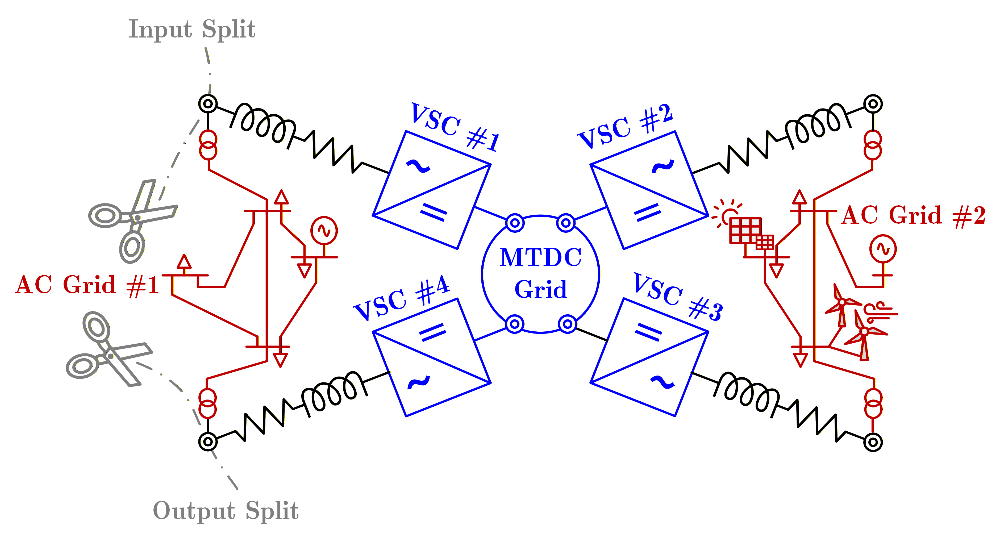
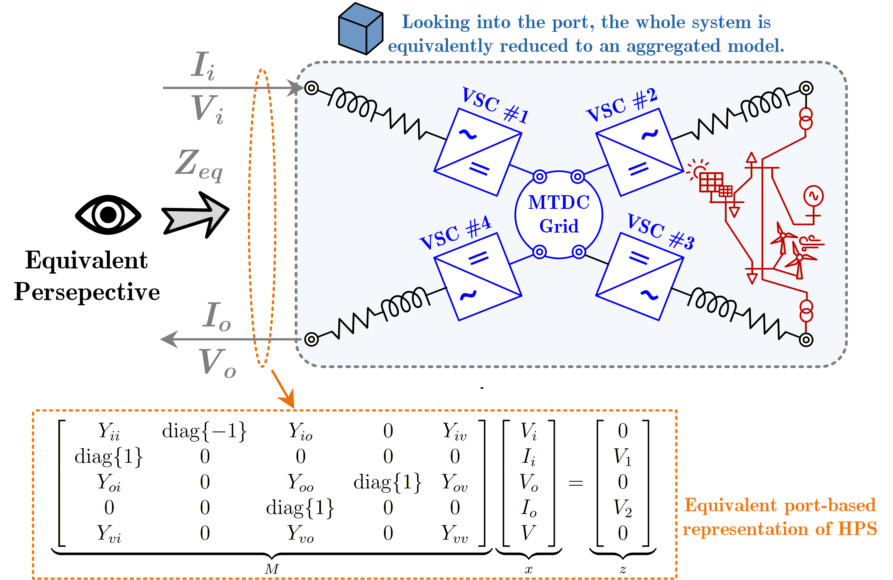

<!--**This model page can be used as template for your own model. If you want to download this page in qmd format, click here:**

<a href="../download/modelTemplate.qmd.txt" download="modelTemplate.qmd">Download model template</a> -->


:::{.callout-tip}
*The HVDC system induces harmonics in the grid. These harmonics entail serious stability issues and are a real source of problems. Before going into system modeling to study the harmonic effect, a basic overview of the nature of the generated harmonics is important—a brief but detailed overview of the nature of harmonics or the multiples of generated harmonics.*
:::

## Theoretical Background

### Ajusted Modified Nodal Analysis Approach

To effectively compute the equivalent impedance for a given circuit, the adjusted modified nodal analysis (MNA) approach is utilized @ho1975modified, which is applied with following steps:

#### Step 1 👣

Determine the input and output of the circuit where you want to determine the equivalent impedance, see @fig-1.

{#fig-1 width=60%}

#### Step 2 👣

Assign input and output current as depicted in @fig-2.

{#fig-2 width=60%}

#### Step 3 👣

Build MNA by adding all components except the ones on the direct connection to the input and output pins. Those components are considered as non-existent as seen in @fig-2. Furthermore, the following sorting of variables should be applied: $\left[V_i, I_i, V_o, I_o, V\right]$, where where $V_i$ and $I_i$ present voltages and currents at the input like depicted in  @fig-2. $V_o$ and $I_o$ are output voltages and currents, and $V$ are other voltage buses/nodes that are not input and output ones.

#### Step 4 👣

Build MNA by adding all components except the ones on the direct connection to the input and output pins. Those components are considered as non-existent as seen in @fig-2. Furthermore, the following sorting of variables should be applied: $\left[V_i, I_i, V_o, I_o, V\right]$, where where $V_i$ and $I_i$ present voltages and currents at the input like depicted in  @fig-2. $V_o$ and $I_o$ are output voltages and currents, and $V$ are other voltage buses/nodes that are not input and output ones.

\begin{equation}
        \underbrace{\begin{bmatrix}
            Y_{ii} & \operatorname{diag}\{-1\} & Y_{io} & 0 & Y_{iv} \\
            \operatorname{diag}\{1\} & 0 & 0 & 0 & 0 \\
            Y_{oi} & 0 & Y_{oo} & \operatorname{diag}\{1\} & Y_{ov} \\
            0 & 0 & \operatorname{diag}\{1\} & 0 & 0 \\
            Y_{vi} & 0 & Y_{vo} & 0 & Y_{vv}
        \end{bmatrix}}_{M}
        \underbrace{\begin{bmatrix}
            V_i \\
            I_i \\
            V_o \\
            I_o \\
            V
        \end{bmatrix}}_{x} =
        \underbrace{\begin{bmatrix}
            0 \\
            V_{1} \\
            0 \\
            V_{2} \\
            0
        \end{bmatrix}}_{z},
        \label{eq:mna}
    \end{equation}

where $Y_{xy}$ are Y parameters for the specified block of nodes $x$ and $y$. Values $V_1$ and $V_2$ are symbolic vectors of values assigned to input and output nodes. With $0$ is denoted zero matrix. For simplicity, the dimensions are skipped in the previous equation. 

#### Step 5 👣

The previous equation \eqref{eq:mna} is solved using the reduced row echelon form @bird2017electrical on the concatenated matrices $M$ and $z$. This will solve the system of equations by enforcing the values for variables $x$ to diagonal 1 values, and on the position of $z$ column would be the expected solution.

#### Step 6 👣

By taking values for $V_i$ and $I_i$ and dividing them, we obtain the equivalent impedance per phase.

### Stability Assessment Procedure

The stability assessment procedure follows the steps:

#### Step 1 👣

Divide components per AC and DC areas, and converter group. Enable pointers for the connections with converters. This has been achieved by defining the SubNetwork class that contains network portions.

#### Step 2 👣

Estimate equivalent admittance parameters of the subnetwork between outputs (connections to converters) for each AC and DC area. Please note that the AC side is transformed to the DQ frame during this calculation inside the Element class @sakinci2022generalized, @hernandez2024comprehensive, given as: 

\begin{equation}
\mathbf Y_{dq}
= \tfrac{1}{6}\, \left\{\mathbf a\,\mathbf Y(j(\omega-\omega_0))\,\mathbf a^{H}
 + \tfrac{1}{6}\,\mathbf a^{*}\,\mathbf Y(j(\omega+\omega_0))\,\mathbf a^{T} \right\}_{dq},
\label{eq:coeffs_full}
\end{equation}

The derivation follows the corrected theorem from Appendix A from \cite{sakinci2019generalized}. Namely, starting from Fourier transformation of the Park transform $P_{\omega_0}(j\omega)$ and $P_{\omega_0}^{-1}(j\omega)$ as:

\begin{equation}
\label{A.3}
P_{\omega_0}(j\omega)
= \frac{2\pi}{3}\Big(\,
    \mathbf{a}\,\delta(\omega-\omega_0)
  + \mathbf{a}^*\,\delta(\omega+\omega_0)
  + \mathbf{c}\,\delta(\omega)
\Big)
\end{equation}
and
\begin{equation}
\label{A.4}
P_{\omega_0}^{-1}(j\omega)
= \pi\Big(\,
    \mathbf{a}^T\,\delta(\omega-\omega_0)
  + \mathbf{a}^{H}\,\delta(\omega+\omega_0)
  + 2\,\mathbf{c}^T\,\delta(\omega)
\Big)
\end{equation}

where $\mathbf{a}*$ is elementwise complex conjugate of $\mathbf{a}$, and $\mathbf{a}^H = (\mathbf{a}*)^T$ is Hermitian transpose of $\mathbf{a}$. Furthermore,
\begin{equation}
    \mathbf{a} = \begin{bmatrix}
        1 & \exp(j \varphi) & \exp(2j \varphi) \\
        j & j \exp(j\varphi) & j\exp(2j \varphi) \\
        0 & 0 & 0
    \end{bmatrix} , \qquad
    \mathbf{c} = \begin{bmatrix}
        0 & 0 & 0 \\
        0 & 0 & 0 \\
        1 & 1 & 1
    \end{bmatrix}.
\end{equation}

Starting from relationship $I_{abc}(j\omega) = Y(j\omega) V_{abc}(j\omega)$, when applying the Park transformation, we get:
\begin{equation}
    I_{dqz}(j\omega) = \frac{1}{2\pi} P_{\omega_0}(j\omega) \otimes \left(Y(j\omega) \frac{1}{2\pi} P^{-1}_{\omega_0} (j\omega) \otimes V_{dqz}(j\omega) \right),
\end{equation}
which gives
\begin{equation}
\begin{aligned}
\mathbf I_{dqz}(j\omega)
 &= \tfrac{1}{6}\,\mathbf a\,\mathbf Y\!\big(j(\omega-\omega_0)\big)\,\mathbf a^{T}\,
    \mathbf V_{dqz}\!\big(j(\omega-2\omega_0)\big) \\[3pt]
 &\quad + \tfrac{1}{6}\,\mathbf a\,\mathbf Y\!\big(j(\omega-\omega_0)\big)\,\mathbf a^{H}\,
    \mathbf V_{dqz}\!\big(j\omega\big)
  + \tfrac{1}{3}\,\mathbf a\,\mathbf Y\!\big(j(\omega-\omega_0)\big)\,\mathbf c^{T}\,
    \mathbf V_{dqz}\!\big(j(\omega-\omega_0)\big) \\[3pt]
 &\quad + \tfrac{1}{6}\,\mathbf a^{*}\,\mathbf Y\!\big(j(\omega+\omega_0)\big)\,\mathbf a^{T}\,
    \mathbf V_{dqz}\!\big(j\omega\big)
  + \tfrac{1}{6}\,\mathbf a^{*}\,\mathbf Y\!\big(j(\omega+\omega_0)\big)\,\mathbf a^{H}\,
    \mathbf V_{dqz}\!\big(j(\omega+2\omega_0)\big) \\[3pt]
 &\quad + \tfrac{1}{3}\,\mathbf a^{*}\,\mathbf Y\!\big(j(\omega+\omega_0)\big)\,\mathbf c^{T}\,
    \mathbf V_{dqz}\!\big(j(\omega+\omega_0)\big) \\[3pt]
 &\quad + \tfrac{1}{6}\,\mathbf c\,\mathbf Y\!\big(j\omega\big)\,\mathbf a^{T}\,
    \mathbf V_{dqz}\!\big(j(\omega-\omega_0)\big)
  + \tfrac{1}{6}\,\mathbf c\,\mathbf Y\!\big(j\omega\big)\,\mathbf a^{H}\,
    \mathbf V_{dqz}\!\big(j(\omega+\omega_0)\big) \\[3pt]
 &\quad + \tfrac{1}{3}\,\mathbf c\,\mathbf Y\!\big(j\omega\big)\,\mathbf c^{T}\,
    \mathbf V_{dqz}\!\big(j\omega\big).
\end{aligned}
\label{eq:Vdq_expanded_corrected}
\end{equation}

#### Step 3 👣

Use formulas for converter cross-connections on DC side given in below equation \eqref{eq:8} and \eqref{eq:9}.

  \begin{eqnarray}
     i_{d,q}^\Delta = Y_{dq} v_{d,q} + a_{2 \times 1} v_{dc}, \label{eq:8} \\
     i_{dc} = b_{1 \times 2} v_{d,q} + Y_{dc} v_{dc},  \label{eq:9}
   \end{eqnarray}

Namely, for the DC admittance visible inside the converter, we use the already known AC side admittance denoted as $Y_{eq,AC}$. Then we have that:
    \begin{eqnarray}
        i^\Delta_{dq} = Y_{dq, conv} v_{dq} + a_{2\times 1, conv} v_{dc} = Y_{eq, AC} v^\Delta_{dq}, \\
        v^\Delta_{dq} = (Y_{eq,AC} - Y_{dq, conv})^{-1} \, a_{2\times 1, conv} \, v_{dc}, \\
        i_{dc} = \underbrace{(b_{1\times 2, conv} \, (Y_{eq,AC} - Y_{dq, conv})^{-1} \, a_{2\times 1, conv} + Y_{dc, conv})}_{Y_{eq, conv}} \, v_{dc}, \label{eq:dc_crosscouple}
    \end{eqnarray}
which is the value used in further calculation.This case is applicable for every converter that is not considered for the local stability check, and for the DC cutting side of the converter, for the  estimation of local stability.

Please note that the calculated admittance parameters $Y_{eq, AC}$ in this case are also the input in the AC network when looking from the AC side of the converter. That is ensured by defining only one so-called output bus of the SubNetwork class.

#### Step 4 👣

Find closing impedance on DC side. Here, we consider equivalent admittance parameters of the DC of the converter, which is examined for stability check, and that bus connection (with converter) we consider as an input. The other DC network outputs are considered outputs closed with ``closing impedance'' determined in the previous step. The closing impedance will look as $Y_L = \operatorname{diag}\{ Y_{eq, conv1} , \cdots , Y_{eq, convN} \}$, for $N$ being the number of converters which are not examined for stability (i.e. one less than the total number of converters in the system, not considering the converters included as a part of RES), and $Z_{eq,conv} = Y_{eq,conv}^{-1}$.

Then we have that the admittance parameters can be divided into $Y_{11}$, $Y_{12}$, $Y_{21}$, and $Y_{22}$ after identifying the input and outputs, and have that:
    
\begin{eqnarray}
  I_{in} = Y_{11} V_{in} + Y_{12} V_{out}, \\
  I_{out} = Y_{21} V_{in} + Y_{22} V_{out}, \\
  V_{out} = - Z_L I_{out},
\end{eqnarray}

and finally, we get that:
\begin{equation}
    I_{in} = \underbrace{Y_{11} + Y_{12} (Y_L + Y_{22}) Y_{21}}_{Y_{eq}} V_{in}.
    \end{equation}

#### Step 5 👣

Couple AC and DC sides of the converter of interest. Here we identify two cases:

(a) If the system is cut on the DC side, then we will use the formula for the DC side cross-coupling \eqref{eq:dc_crosscouple}, and the admittance on its AC side calculated in step 1, and calculate the transfer function as: $TF(s) = Y_{eq, conv} Y_{eq, DC}^{-1}$.

(b) If the system is cut on the AC side, we use the admittance calculated in step 4, estimate the admittance visible at the converter's AC side as follows.

To estimate the AC admittance, we follow the same procedure, and we have:

\begin{eqnarray}
  i_{dc} = b_{1\times 2, conv} \, v_{dq}^\Delta + Y_{dc, conv} \, v_{dc} = Y_{eq,DC} \, v_{dc}, \\
  v_{dc} = \frac{b_{1\times 2, conv} \, v_{dq}^\Delta}{Y_{eq,DC} - Y_{dc, conv}}, \\
  i^\Delta_{dq} = \underbrace{\left( Y_{dq,conv} + \frac{a_{2 \times 1, conv} b_{1 \times 2, conv}}{Y_{eq,DC} - Y_{dc, conv}} \right)}_{Y_{eq,conv}} \, v_{dc}.         
\end{eqnarray}

Finally, calculate the transfer function with the AC admittance calculated in step 1 as $TF(s) = Y_{eq, conv} Y_{eq, AC}^{-1}$.

## Code Explanation

The following example implements a simple hybrid AC/DC system and evaluates the small-signal transfer function of a selected MMC converter.

### General Workflow

---

#### Network Definition 👣

```cpp
#include "Examples.h"

#include "../network.h"
#include "../Bus.h"
#include "../Include_components.h"
#include "../Solver/Stability_Estimate/Stability_estimate.h"
#include "../Solver/OPF/powerflow.h"

void example_stability_check() {

    Network net;
```

A global `Network` object is created to store all buses and components.

---

####  AC and DC System Construction 👣

```cpp
    /* AC buses */
    Bus* bus1_ac = new Bus("ACBUS01", "AC1", 3);
    Bus* bus2_ac = new Bus("ACBUS02", "AC1", 3);
    Bus* bus3_ac = new Bus("ACBUS03", "AC2", 3);
    Bus* bus4_ac = new Bus("ACBUS04", "AC2", 3);

    /* DC buses */
    Bus* bus1_dc = new Bus("DCBUS01", "DC1", 1);
    Bus* bus2_dc = new Bus("DCBUS02", "DC1", 1);
```

Two AC areas and one DC area are defined.  

---

#### Component Connections 👣

```cpp
    /* Load and source */
    Load* load2 = new Load("LOAD02", "AC2", 3, load_params2);
    net.connectElementToBus(load2, 1, bus4_ac);

    AC_source* src1 = new AC_source("SRC01", "AC1", 3, 345e3, Zsrc);
    net.connectElementToBus(src1, 1, bus1_ac);

    /* DC branch */
    Impedance* br1_dc = new Impedance("br1_dc", "DC1", 1, 0.05);
    net.connectElementToBus(br1_dc, 1, bus1_dc);
    net.connectElementToBus(br1_dc, 2, bus2_dc);
```

Loads, source, and DC impedance define the steady-state power flow structure.

---

#### MMC Converter Modeling 👣

```cpp
    MMC* mmc1 = new MMC("MMC1", "AC1_DC1",
                        converter_params1,
                        controller_params1);

    net.connectElementToBus(mmc1, 1, bus2_ac);
    net.connectElementToBus(mmc1, 2, bus1_dc);
```

The MMC connects the AC and DC areas.  

---

#### Steady-State Solution 👣

```cpp
    PowerFlow pf;
    pf.make_OPF(&net, global_params, false, false, false, true);
```

An OPF-based steady-state solution is computed before small-signal analysis.  
This provides the operating point for impedance evaluation.

---

#### Stability Evaluation 👣

```cpp
    StabilityEstimate* stability = new StabilityEstimate();
    stability->add_areas(&net);

    stability->compute_transfer_function("MMC2", "AC", 1000);

    delete stability;
}
```

The stability module:

- Partitions the network into subnetworks  
- Aggregates equivalent admittances  
- Computes the transfer function  

For the AC-cut case, the transfer function corresponds to:

\[
TF(s) = Y_{eq,conv} \, Y_{eq,AC}^{-1}
\]

evaluated at the selected frequency.

---

### Execution Results 

First, the OPF results are printed, showing the bus voltages, generation, load, and branch flows. 

```text
=================================================================================================
|   AC  Grid Bus Data                                                                           |
=================================================================================================
 Area    Bus        Voltage             Generation            Load                 RES
 #       #     Mag [pu]/Ang [deg]  Pg [MW]   Qg [MVAr]  P [MW]   Q [MVAr]  Pres [MW]  Qres[MVAr]
-----   -----  ------------------  --------  ---------  -------  -------   ---------  -----------
  1       1    1.093  /   0.00*         -          -      0.00     0.00         -          -
  1       2    1.093  /   0.02          -          -      0.00     0.00         -          -
  1       3    1.093  /  -0.00       52.20      16.85     0.00     0.00         -          -
  2       1    1.091  /   0.00          -          -      0.00     0.00         -          -
  2       2    1.091  /   0.02          -          -     50.18    10.07         -          -
-----   -----  ------------------  --------  ---------  -------  -------   ---------  -----------
 The total generation cost is $712.44/MWh (€659.66/MWh)

===========================================================================================
|     AC Grids Branch Data                                                                |
===========================================================================================
 Area   Branch  From   To        From Branch Flow         To Branch Flow        Branch Loss
 #      #       Bus#   Bus#    Pij [MW]   Qij [MVAr]    Pij [MW]   Qij [MVAr]  Pij_loss [MW]
 ----   ------  -----  -----  ---------  ----------   ----------  ----------  -------------
  1      1       1      2       52.279      -9.318      -52.275       9.357       0.004
  1      2       1      3      -52.198      18.328       52.198      13.767       0.000
  2      1       1      2       50.104       9.295      -50.100      -9.263       0.003
 ----   ------  -----  -----  ---------  -----------    --------  ----------  -------------
 The total AC network losses is 0.007 MW.

================================================================================
|   MTDC Bus Data                                                              |
================================================================================
 Bus   Bus    AC   DC Voltage   DC Power   PCC Bus Injection   Converter loss
 DC #  AC #  Area   Vdc [pu]    Pdc [MW]   Ps [MW]  Qs [MVAr]  Conv_Ploss [MW]
 -----  ----  ----  ---------    --------   -------  --------   ------------
   1     1     2     1.197       -51.171   -50.104   -9.295      1.155
   2     2     1     1.197        51.173    52.275   -9.357      1.188
-----  ----  ----  ---------    --------   -------  --------    --------
 The total converter losses is 2.344 MW

===================================================================
|     MTDC Branch Data                                             |
===================================================================
 Branch  From   To     From Branch    To Branch      Branch Loss
 #       Bus#   Bus#   Flow Pij [MW]  Flow Pij [MW]  Pij_loss [MW]
 ------  -----  -----   ---------      ---------      ---------
    1      1      2     -51.171         51.173         0.002
 ------  -----  -----   ---------      ---------      ---------
 The total DC network losses is 0.002 MW.

 Execution time is 0.153 s

 ```

 Then, MMC operating points are updated with the OPF results, and the equilibrium state is printed for each MMC. 

 ```text

=== Updating 2 MMC elements with OPF results ===
Converged (small step) in 1491 iterations.
[Updated MMC] MMC2 | Vm=376.266 kV, theta=0.000 deg, Pac=-50.104 MW, Qac=-9.295 MVar, Vdc=412.837 kV, Pdc=-51.171 MW
Equilibrium state:
   -90.697     16.469    -41.317     -0.000     -0.000   -536.614   1909.500      0.646      0.761    236.244  -1317.610 412833.448
Converged (small step) in 176414 iterations.
[Updated MMC] MMC1 | Vm=377.189 kV, theta=0.021 deg, Pac=52.275 MW, Qac=-9.357 MVar, Vdc=412.840 kV, Pdc=51.173 MW
Equilibrium state:
    92.395     16.537     42.223      0.000      0.000   -538.883  -1975.195      0.701     -0.774    237.911   1345.923 412836.345

=== StabilityEstimate: Area Summary ===
AC Grids Detected: 2
  - AC2 (2 buses, 2 elements, 1 outputs)
  - AC1 (2 buses, 2 elements, 1 outputs)
DC Grids Detected: 1
  - DC1 (2 buses, 1 elements, 2 outputs)

Y1 at 1000 Hz:
(0.0006251813,-0.0045456903) (0.0000080989,-0.0000237153)  (0.0000034384,0.0000338422)
(-0.0033601746,0.0028059178) (0.0000567312,-0.0000600855) (-0.0000607055,0.0000520370)
(0.0000149273,-0.0000057094) (-0.0000114782,0.0000123063)  (0.0001530480,0.0002909866)

Y2 at 1000 Hz:
(-0.1296974762,-1.1061076269)  (-0.0000327654,0.0000043749)  (0.0000325752,-0.0000033223)
(-1.2724353572,-0.6174201797)  (0.0000380460,-0.0000613489)  (0.0000214998,-0.0000383601)
(-0.0013739688,-0.0013977386)  (-0.0000002174,0.0000026871)   (0.0002159779,0.0002087296)
```

## References

::: {#refs}
:::

<!--
**Example:**

The synchronous machine is one of the most studied component of a power system, being its main source of electrical energy. 
It is the most common type of generators, and it is present in most power plants (thermal, hydro, and some wind) as an interface between the mechanical energy and electrical energy. The mathematical model presented in this article develops the dynamic equations of synchronous machines @DUMMY:1 
It only covers the physical part of the machine (see @sec-physical-description) not the regulations nor protections schemes. 

## Model use, assumptions, validity domain and limitations (mandatory)

*Each model is an approximation of the reality, and considers some assumptions.*

*In this section, details should be given on:*

- *the validity domain of the model (frequency range, type of dynamics, type of stability phenomena) that the model covers,*
- *the model assumptions (e.g., neglecting the DC side of the converter, simplistic PLL representation)*
- *the limitations of the model (what people shouldn't use the model for)*

**Example:**

The model presents the general expressions in abc reference frame of the differential equations that model a general synchronous machine with the following assumptions:
- There are three stator windings ( $a, b, c$) distributed 120º apart one from each other, each of them with equal parameters (i.e. same resistance, inductance...).
- The three phases are balanced, meaning the power is shared equally.
- The rotor has one winding with a field ($e_f$) applied and three damper windings, with no power source, one of them with the axis parallel to the field winding ($1d$) and the other two with a perpendicular axis ($1q,2q$).
- The magnetic field produced by the rotor winding oscillates sinusoidally.
- The machine may have 2 or more poles, noted as $p_f$
The model is suitable for transient stability analysis but not for electromagnetic transient analysis.


## Model description (mandatory){#sec-physical-description}

*This section gives the full description of the different model's components.*
*For each component, is given: a brief explanation about the functioning of the component (how it works, what it is made of, which implementation choices are made) and the component equations or control diagram. The author can also point to another component page if the component is already explained in another page. In such case, he clearly needs to make coherence is achieved with the rest of the model in terms of notation, convention, and connection aspects.*

- _**For the equation system / algorithm :** the author can use Latex language, which is fully compatible with markdown. He can also use numbered equations. The variables and parameters should be clearly specified, as well as their type (complex, real, etc.), unit (MW, MVA, etc), and meaning (phase to neutral voltage for the output terminal A). The notation should follow scientific standards._

- _**Images or Electric/Electronic/Control/Phasor diagramscan be added** for clarity. The image must be of good quality and more preferably in .svg format. Diagrams can be used instead of equations to describe the component. The selected control blocks should be unambiguous, that is to say that their equations should be clearly understood from the diagram. A list of basic blocks can be found in colib here: pages/models/controlBlocks/.  Several packages can be used to display diagrams, e.g.: [draw.io](https://www.drawio.com/) plugin for github allows you to make your own diagram easily. The diagram is fully editable with github commit using a graphical interface, and allowing multiple format outputs (for more details, see: [draw.io github](https://app.diagrams.net/)). _

- _**Initial equations/boundary conditions:** when initial equations or boundary conditions are necessary to fully described the system, a subsection dedicated to those aspects can be added in this section._


**Example:**

### Physical description 

The following schematic shows the components that participate in the synchronous machine operation:

{#fig-SM1 fig-alt="Synchronous machine" width="400px"}

[...]

### Synchronous machine equations

#### Variables 

| Variable    | details  | Unit |
| --------------| ------ | ----- |
| $\theta_{shaft}$ | Rotor angle | $rad$ |
| $\omega$ | Electrical rotational speed | $rad/s$ |
| $T_m$ | Mechanical torque | $Nm$ |
| $T_e$ | Electrical torque | $Nm$ |

[...]

#### Parameters

| Parameter | Description | Unit |
| --- | --- | --- |
| $J$ | Moment of inertia | $kgm^2$ |
| $p_f$ | Number of pole pairs | - |
| $R_a$, $R_b$, $R_c$ | Stator phase resistances | $\Omega$ |

[...]

#### System of equations

The following system of equations describe a general synchronous machine with the considered assumptions. Some of its parameters are generally non-constant, meaning it is not directly solved without making some additional assumptions. The particular models are derivations of this system of equations.

The equations  @eq-inertia, @eq-theta  represent the mechanical dynamic equations:
$$
J\frac{2}{p_f}  \frac{d\omega_m}{dt} = T_m - T_e - T_{fw}
$$  {#eq-inertia}
$$\frac{d\theta_{shaft}}{dt} = \frac{2}{p_f} \omega$$  {#eq-theta}

[...]


## Source code (optional)

_This section is a code section that provides the source code for model described above._

_The code **should correspond strictly the equations/diagram/algorithm described before** and should have been validated in a tool. The date of the code should be specified at the beginning of the section, the code should be clean, readable and organized._

**Example:**
The code can be presented in a **modeling language code block** like this:

```modelica
model VoltageSource "Constant AC voltage"
  extends Interfaces.Source;
  parameter SI.Frequency f(start=1) "Frequency of the source";
  parameter SI.Voltage V(start=1) "RMS voltage of the source";
  parameter SI.Angle phi(start=0) "Phase shift of the source";
equation
  omega = 2*Modelica.Constants.pi*f;
  v = Complex(V*cos(phi), V*sin(phi));
end VoltageSource;
```

## Open source implementations (if any)

_This section give a list of the different open source implementations of this model. It provides the reader with links and languages/software used for each implementations. A markdown table can be used to display such list._

**Example:**

This model has been successfully implemented in :

| Software      | URL | Language | Open-Source License | Last consulted date | Comments |
| --------------| --- | --------- | ------------------- |------------------- | -------- |
| Software name | [Link](https://github.com/toto) | modelica | [MPL v2.0](https://www.mozilla.org/en-US/MPL/2.0/)  | XX/0X/20XX | Comments can contain implementations details such as validation means, implementations key choices, etc. |

## Table of references & license

_This section lists all the references. It must comply with current citation standards. Quarto uses BibTeX for managing reference._


::: {#refs}
:::
-->